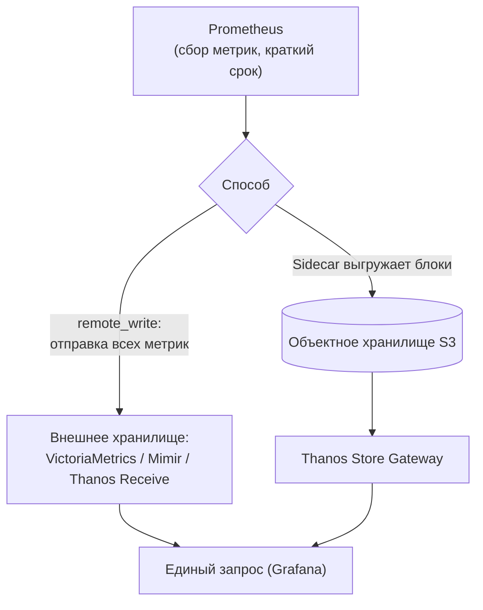

# Долгое хранение метрик: Thanos, Mimir, VictoriaMetrics

↑ [[DO Этап 7 · Observability и эксплуатация|Этап 7 · Observability и эксплуатация]]

<!-- meta:start -->
<div class="meta-strip"><span class="badge should">Желательно</span><span class="chip">~5 мин чтения</span><span class="chip">Уровень: senior</span></div>
<!-- meta:end -->

> [!info] Зачем это на собесе
> Один Prometheus хранит данные на локальном диске и рассчитан на недели. Вопросы senior-уровня: «Как хранить метрики год?», «Как объединить несколько кластеров?», «Что такое remote_write?» Ответ включает сравнение Thanos, Mimir и VictoriaMetrics.

## Подтемы
- [ ] Ограничения одного Prometheus
- [ ] remote_write и объектное хранилище
- [ ] Thanos, Mimir, VictoriaMetrics
- [ ] Downsampling и retention
- [ ] Как выбрать

## Объяснение

### Ограничения одного Prometheus
- Локальное хранилище на одном узле: нет репликации и долгого хранения (по умолчанию 15 дней).
- Масштабируется вертикально; запросы к данным нескольких кластеров приходится выполнять по отдельности.
- Потеря диска означает потерю истории.

### Два пути решения

- **remote_write** — Prometheus по протоколу отправляет копию метрик в удалённое хранилище.
- **Выгрузка блоков** в S3-совместимое хранилище (Thanos Sidecar) с последующим запросом через общий слой.

### Сравнение
| Решение | Архитектура | Особенности |
|---|---|---|
| **Thanos** | компоненты рядом с Prometheus: Sidecar, Store Gateway, Querier, Compactor | дешёвое хранение в S3, глобальный запрос, downsampling, лицензия Apache 2.0 |
| **Grafana Mimir** | горизонтально масштабируемое хранилище, принимает remote_write | мультитенантность, высокая масштабируемость, лицензия AGPLv3 |
| **VictoriaMetrics** | одиночный узел или кластерная версия | простая эксплуатация, высокая степень сжатия, PromQL-совместимый язык MetricsQL |

Объектное хранилище для Thanos и Mimir может быть любым S3-совместимым, см. [[DB 4.2.7 Аналоги MinIO — SeaweedFS, Garage, Ceph RGW и облачные S3|аналоги MinIO]].

### Retention и downsampling
**Retention** ограничивает срок хранения. **Downsampling** хранит старые данные с меньшим разрешением (например, 5-минутные и часовые точки вместо 15-секундных): экономит место и ускоряет запросы по длинным периодам. Thanos Compactor делает downsampling автоматически.

### Как выбрать
| Ситуация | Решение |
|---|---|
| Один-два Prometheus, нужно дольше хранить и проще эксплуатировать | VictoriaMetrics (одиночный узел) |
| Много кластеров, нужен глобальный вид и дешёвое хранение в S3 | Thanos |
| Мультитенантность и очень большой масштаб | Mimir или кластерная VictoriaMetrics |
| Метрик мало | Prometheus с увеличенным retention и бэкапом диска |

## Примеры

### Prometheus: локальное хранение и remote_write
```yaml
# prometheus.yml
global:
  scrape_interval: 15s
remote_write:
  - url: http://victoriametrics:8428/api/v1/write
```
```bash
# срок хранения локально (флаг запуска Prometheus)
prometheus --storage.tsdb.retention.time=15d --config.file=prometheus.yml
```

### Запуск VictoriaMetrics с годом хранения
```bash
docker run -d --name vm -p 8428:8428 -v vmdata:/victoria-metrics-data \
  victoriametrics/victoria-metrics -retentionPeriod=12
```
Значение `12` означает 12 месяцев. Grafana подключает VictoriaMetrics как источник типа Prometheus по адресу `http://victoriametrics:8428`.

## Нюансы и подводные камни
- **Кардинальность** ломает любое хранилище: контролируйте метки ([[DB 4.3.3 Временные ряды — TimescaleDB, InfluxDB, VictoriaMetrics|временные ряды]]).
- **remote_write увеличивает нагрузку.** Следите за очередью отправки и метрикой отставания.
- **Двойное хранение.** Prometheus всё равно хранит данные локально, настройте retention под оба уровня.
- **Высокая доступность Prometheus** делают парой одинаковых инстансов; Thanos и Mimir умеют дедупликацию реплик.
- **Лицензии.** У Mimir AGPLv3: учитывайте при встраивании и модификации.
- **Запросы за длинный период** тяжёлые: используйте downsampled данные и recording rules.

## Вопросы с ответами
> [!question]- Почему одного Prometheus недостаточно для долгого хранения?
> Он хранит данные на локальном диске одного узла, без репликации и с коротким сроком по умолчанию. При потере диска теряется история, а несколько кластеров нельзя запросить вместе.

> [!question]- Что такое remote_write?
> Механизм Prometheus, который отправляет копию собираемых метрик во внешнее хранилище (VictoriaMetrics, Mimir и другие) для долгого хранения и глобальных запросов.

> [!question]- Чем Thanos отличается от VictoriaMetrics?
> Thanos добавляет к Prometheus компоненты, которые выгружают блоки в объектное хранилище и дают глобальный запрос и downsampling. VictoriaMetrics это самостоятельное хранилище, принимающее remote_write, с простой эксплуатацией и хорошим сжатием.

> [!question]- Что такое downsampling?
> Хранение старых данных с меньшей частотой точек. Экономит место и ускоряет запросы по долгим периодам.

> [!question]- Что такое мультитенантность в Mimir?
> Изоляция данных нескольких команд или клиентов в одном кластере по идентификатору тенанта с отдельными лимитами.

## Связанные темы
- Метрики: [[DO 7.1 Метрики — Prometheus, типы метрик, PromQL|Метрики и PromQL]]
- Экспортеры: [[DO 7.2 Экспортеры — node_exporter, cAdvisor, blackbox, postgres_exporter|Экспортеры]]
- Grafana: [[DO 7.3 Grafana — дашборды, источники (Prometheus, ClickHouse, Loki), алерты|Grafana]]
- Временные ряды в БД: [[DB 4.3.3 Временные ряды — TimescaleDB, InfluxDB, VictoriaMetrics|Временные ряды]]
