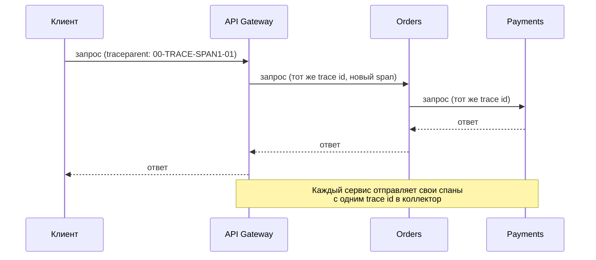
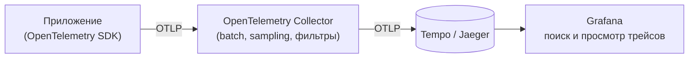

# Распределённый трейсинг: Tempo, Jaeger, sampling

↑ [[DO Этап 7 · Observability и эксплуатация|Этап 7 · Observability и эксплуатация]]

<!-- meta:start -->
<div class="meta-strip"><span class="badge should">Желательно</span><span class="chip">~9 мин чтения</span><span class="chip">Уровень: middle</span></div>
<!-- meta:end -->

> [!info] Зачем это на собесе
> «Запрос в микросервисной системе тормозит, как найти где?» Метрики показывают, что медленно, логи что произошло, а трейс показывает путь одного запроса через все сервисы. Ждут, что вы знаете разницу между сборщиком и хранилищем трассировок, понимаете sampling и умеете связать трейсы с логами и метриками.

## Подтемы
- [ ] Трейс, span, контекст
- [ ] Путь данных: приложение, Collector, хранилище
- [ ] Tempo и Jaeger
- [ ] Sampling: head и tail
- [ ] Корреляция с логами и метриками

## Объяснение

### Основные понятия
- **Trace** — путь одного запроса через систему; **span** — одна операция внутри него со временем начала и длительностью, родителем и атрибутами.
- **Контекст трассировки** передаётся между сервисами в заголовке (`traceparent` по стандарту W3C Trace Context), поэтому спаны разных сервисов собираются в одно дерево.



### Путь данных

Приложение отправляет спаны по протоколу OTLP в **Collector** ([[DO 7.5 OpenTelemetry Collector в инфраструктуре — пайплайны, экспорт в ClickHouse и Kafka|OpenTelemetry Collector]]). Он батчит, фильтрует, семплирует и пересылает в хранилище.

### Tempo и Jaeger
| | Grafana Tempo | Jaeger |
|---|---|---|
| Хранение | объектное хранилище (S3-совместимое), индексирует только trace id | Elasticsearch/OpenSearch, Cassandra и другие бэкенды |
| Поиск | по trace id, в новых версиях TraceQL по атрибутам | по сервису, операции, тегам, времени |
| Стоимость | низкая (дешёвое хранение объектов) | выше при индексировании атрибутов |
| Интеграции | тесно с Grafana, Loki, Prometheus | собственный UI |
| Принимает | OTLP, Jaeger, Zipkin | OTLP (v2 построен на OpenTelemetry Collector) |

Tempo хорош, когда уже есть Grafana-стек и нужна дешёвая долговременная память. Jaeger удобен, когда нужен самостоятельный UI с поиском по тегам.

### Sampling: сколько трейсов хранить
Хранить все трейсы дорого. Поэтому **семплируют**.

| Вид | Где решается | Плюсы и минусы |
|---|---|---|
| **Head sampling** | при создании трейса, например 10 % | просто и дёшево, но можно потерять редкие ошибки и медленные запросы |
| **Tail sampling** | после сбора всего трейса | можно оставить все ошибки и медленные, но Collector должен накопить спаны трейса в памяти |

Обычная стратегия: все ошибки и запросы дольше порога плюс небольшой процент остальных (tail sampling в Collector).

### Корреляция сигналов
- В логи пишут `trace_id` и `span_id`: из лога переходят к трейсу в Grafana.
- **Exemplars** привязывают к точке метрики конкретный trace id: из графика задержки переход к типичному медленному трейсу.
- Атрибуты спанов (`service.name`, `http.route`, `db.system`) унифицируют по всем сервисам.

## Примеры

### Collector с tail sampling и экспортом в Tempo
```yaml
receivers:
  otlp:
    protocols:
      grpc: {}
      http: {}
processors:
  tail_sampling:
    decision_wait: 10s
    policies:
      - name: errors
        type: status_code
        status_code: { status_codes: [ERROR] }
      - name: slow
        type: latency
        latency: { threshold_ms: 500 }
      - name: sample-rest
        type: probabilistic
        probabilistic: { sampling_percentage: 10 }
  batch: {}
exporters:
  otlp/tempo:
    endpoint: tempo:4317
    tls:
      insecure: true
service:
  pipelines:
    traces:
      receivers: [otlp]
      processors: [tail_sampling, batch]
      exporters: [otlp/tempo]
```
`tail_sampling` входит в сборку `opentelemetry-collector-contrib`. Все спаны одного трейса должны попадать в один экземпляр Collector (балансировка по trace id).

### Включение трассировки в ASP.NET Core
```csharp
builder.Services.AddOpenTelemetry()
    .ConfigureResource(r => r.AddService("orders"))
    .WithTracing(t => t
        .AddAspNetCoreInstrumentation()
        .AddHttpClientInstrumentation()
        .AddOtlpExporter());          // адрес берётся из OTEL_EXPORTER_OTLP_ENDPOINT
```
Подробности о библиотеках и метриках: [[BE 7.2 Observability — логи, метрики, трейсинг, OpenTelemetry|Observability на бэкенде]].

## Нюансы и подводные камни
- **Контекст должен проходить везде.** Если один сервис не передаёт `traceparent` (старая библиотека, очередь без заголовков), трейс рвётся на две части.
- **Очереди и фоновые задачи** нужно связывать вручную: кладите контекст в заголовки сообщения.
- **Объём.** Без sampling хранилище и сеть быстро переполняются.
- **Атрибуты с персональными данными.** Не записывайте в спаны пароли, токены, тела запросов.
- **Высокая кардинальность атрибутов** в индексируемых бэкендах (Jaeger на Elasticsearch) удорожает хранение.
- **Время.** Часы серверов должны быть синхронизированы, иначе спаны «едут» по временной шкале.

## Вопросы с ответами
> [!question]- Чем трейсы отличаются от логов и метрик?
> Метрики показывают агрегированное состояние, логи события, а трейс путь одного запроса через сервисы с длительностью каждого шага. Трейс отвечает на вопрос, где именно запрос потратил время.

> [!question]- Как сервисы связываются в один трейс?
> Контекст (`trace id`, `span id`) передаётся в заголовке `traceparent` стандарта W3C Trace Context; каждый сервис создаёт спаны в том же трейсе и отправляет их в коллектор.

> [!question]- В чём разница между head и tail sampling?
> Head решает в начале трейса (например, хранить 10 %), дёшево, но может потерять редкие ошибки. Tail решает после получения всего трейса и может оставить все ошибки и медленные запросы, но требует накопления спанов в памяти Collector.

> [!question]- Чем Tempo отличается от Jaeger?
> Tempo хранит трейсы в объектном хранилище и индексирует минимум, поэтому дёшев, хорошо связан с Grafana. Jaeger имеет собственный UI и индексирует теги в Elasticsearch или Cassandra, поиск по тегам богаче, но хранение дороже.

> [!question]- Зачем нужен OpenTelemetry Collector?
> Он принимает данные от приложений, батчит, фильтрует и семплирует их и пересылает в разные хранилища, отвязывая приложения от конкретного бэкенда.

> [!question]- Как перейти от метрики к трейсу?
> Через exemplars (к точке метрики привязан trace id) и через `trace_id` в логах. В Grafana по ним открывают нужный трейс.

## Связанные темы
- Collector: [[DO 7.5 OpenTelemetry Collector в инфраструктуре — пайплайны, экспорт в ClickHouse и Kafka|OpenTelemetry Collector]]
- Метрики: [[DO 7.1 Метрики — Prometheus, типы метрик, PromQL|Метрики и PromQL]]
- Логи: [[DO 7.4 Логи — ELK, Loki, централизованный сбор|Логи: ELK, Loki]]
- Инструментирование: [[BE 7.2 Observability — логи, метрики, трейсинг, OpenTelemetry|Observability на бэкенде]]
