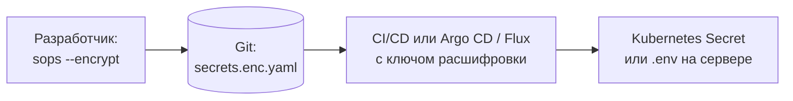
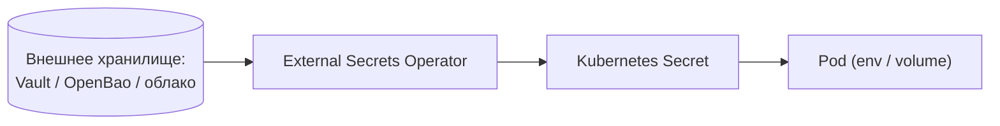

# Аналоги Vault: OpenBao, SOPS и External Secrets

↑ [[DO Этап 8 · Senior — надёжность, безопасность, платформа|Этап 8 · Senior — надёжность, безопасность, платформа]]

<!-- meta:start -->
<div class="meta-strip"><span class="badge nice">По желанию</span><span class="chip">~7 мин чтения</span><span class="chip">Уровень: senior</span></div>
<!-- meta:end -->

> [!info] Зачем это на собесе
> «Где хранить секреты и чем заменить Vault?» Сильный ответ не перечисляет продукты, а разделяет задачи: хранение и выдача секретов, шифрование файлов в git, доставка секретов в Kubernetes, динамические учётные данные. Для каждой свой инструмент.

## Подтемы
- [ ] Почему ищут замену HashiCorp Vault
- [ ] OpenBao
- [ ] SOPS и age: секреты в git
- [ ] External Secrets Operator
- [ ] Облачные менеджеры секретов
- [ ] Как выбрать

## Объяснение

### Почему появились альтернативы
В августе 2023 HashiCorp перевёл свои продукты, включая Vault, с MPL 2.0 на Business Source License (BSL): свободное использование ограничено для конкурирующих сервисов. В ответ Linux Foundation поддержал форк **OpenBao** под лицензией MPL 2.0. Параллельно активно развиваются инструменты, которые решают часть задач Vault проще.

### Какие задачи решают секреты
| Задача | Инструменты |
|---|---|
| Центральное хранилище и выдача секретов по API, политики доступа, аудит | Vault, OpenBao, облачные менеджеры |
| Динамические, короткоживущие учётные данные (для БД, облака) | Vault, OpenBao |
| Шифрование секретов в репозитории (GitOps) | SOPS, Sealed Secrets |
| Доставка секретов в Kubernetes из внешнего хранилища | External Secrets Operator, Secrets Store CSI Driver |
| Секреты как сервис с удобным интерфейсом | Infisical, Doppler и подобные |

### OpenBao
Форк Vault на основе последней версии под MPL 2.0, поддерживаемый Linux Foundation. API и подходы совместимы с Vault: движки секретов, политики, методы аутентификации, аудит. Подходит тем, кто хочет тот же набор возможностей под свободной лицензией. Состав возможностей сверяйте с актуальной версией.

### SOPS и age: шифрованные секреты в git
**SOPS** шифрует значения в YAML, JSON и env-файлах, оставляя ключи видимыми, поэтому diff в git остаётся читаемым. Ключи шифрования: **age**, PGP или облачный KMS (AWS KMS, GCP KMS, Azure Key Vault).


Это решение для GitOps без отдельного сервера секретов. Минусы: нет динамических секретов, аудита доступа и отзыва «на лету». Ключ расшифровки надо защищать.

### External Secrets Operator
Оператор Kubernetes, который синхронизирует секреты из внешних хранилищ (Vault, OpenBao, AWS Secrets Manager, Azure Key Vault, GCP Secret Manager, Yandex Lockbox и других) в обычные `Secret` кластера. Приложения не знают о внешнем хранилище: читают `Secret` как обычно.



### Облачные менеджеры секретов
AWS Secrets Manager, Azure Key Vault, Google Secret Manager, Yandex Lockbox: управляемые сервисы с разграничением доступа через IAM, аудитом и ротацией. Проще всего, если вы уже в этом облаке; минус: привязка к провайдеру.

### Как выбрать
| Ситуация | Выбор |
|---|---|
| Нужен полноценный сервер секретов и динамические учётные данные, важна лицензия | OpenBao (или Vault, если BSL подходит) |
| Небольшая команда, GitOps, секреты в репозитории | SOPS с age или KMS |
| Kubernetes и внешнее хранилище | External Secrets Operator |
| Вы в одном облаке | управляемый менеджер секретов провайдера |

## Примеры

### SOPS с age
```bash
age-keygen -o key.txt                                   # создаёт ключ, публичная часть: строка age1...
export SOPS_AGE_KEY_FILE=key.txt

cat > secrets.yaml <<'YAML'
db_password: s3cret
api_key: abc123
YAML

sops --encrypt --age age1xxxxxxxx secrets.yaml > secrets.enc.yaml   # публичный ключ из key.txt
sops --decrypt secrets.enc.yaml                                      # расшифровка тем же ключом
```
Файл `secrets.enc.yaml` можно коммитить: значения зашифрованы, ключи YAML видны. Файл `key.txt` в git не кладут.

### External Secrets: секрет из внешнего хранилища
```yaml
apiVersion: external-secrets.io/v1beta1     # версия API зависит от релиза оператора
kind: ExternalSecret
metadata:
  name: app-db
spec:
  refreshInterval: 1h
  secretStoreRef:
    name: vault-store
    kind: ClusterSecretStore
  target:
    name: app-db            # имя создаваемого Kubernetes Secret
  data:
    - secretKey: password   # ключ в Secret
      remoteRef:
        key: secret/app/db  # путь во внешнем хранилище
        property: password
```

## Нюансы и подводные камни
- **Секрет в Kubernetes `Secret` — это base64, а не шифрование.** Включайте шифрование etcd и ограничивайте RBAC.
- **Секреты в переменных окружения** попадают в дампы и `docker inspect`; предпочитайте файлы в tmpfs, где возможно.
- **Ротация.** Продумайте, как приложения подхватывают новые значения (перечитывание файла, перезапуск).
- **Master-ключ и unseal.** Self-hosted хранилище само нуждается в защите и восстановлении ключей (см. [[DO 8.3 Управление секретами — Vault, sealed secrets, принцип наименьших привилегий|управление секретами]]).
- **Аудит и принцип наименьших привилегий.** У каждого сервиса доступ только к своим путям.
- **Лицензии меняются.** Проверяйте актуальные условия продукта до внедрения.
- **Не храните секреты в образах и репозиториях в открытом виде.** Сканеры утечек (gitleaks) встраивают в CI.

## Вопросы с ответами
> [!question]- Почему появился OpenBao?
> В 2023 году HashiCorp перевёл Vault на лицензию BSL. Linux Foundation поддержал форк OpenBao под MPL 2.0, совместимый по подходам и API с Vault.

> [!question]- Чем SOPS отличается от Vault?
> SOPS шифрует файлы в git и не является сервером: нет динамических секретов, политик доступа и аудита. Vault выдаёт секреты по API с политиками, аудитом и динамическими учётными данными.

> [!question]- Что делает External Secrets Operator?
> Синхронизирует секреты из внешнего хранилища в Kubernetes `Secret` по описанию `ExternalSecret`. Приложения используют обычные `Secret`, не зная о внешней системе.

> [!question]- Безопасен ли Kubernetes Secret сам по себе?
> Значения только закодированы в base64. Безопасность обеспечивают шифрование etcd, строгий RBAC и, по возможности, внешнее хранилище.

> [!question]- Как хранить секреты в репозитории для GitOps?
> Шифровать их SOPS (с age или KMS) или Sealed Secrets, а ключ расшифровки держать вне репозитория (в CI, в кластере, в KMS).

> [!question]- Что такое динамические секреты?
> Короткоживущие учётные данные, которые сервер секретов создаёт по запросу (например, пользователь БД на час) и автоматически отзывает. Уменьшают ущерб от утечки.

## Связанные темы
- Управление секретами: [[DO 8.3 Управление секретами — Vault, sealed secrets, принцип наименьших привилегий|Управление секретами]]
- Секреты в CI: [[DO 3.8 Секреты и окружения — dev, staging, prod|Секреты и окружения]]
- GitOps: [[DO 8.4 GitOps — ArgoCD и Flux|GitOps: ArgoCD и Flux]]
- Kubernetes Secret: [[DO 5.7 ConfigMap, Secret, Namespace|ConfigMap, Secret, Namespace]]
