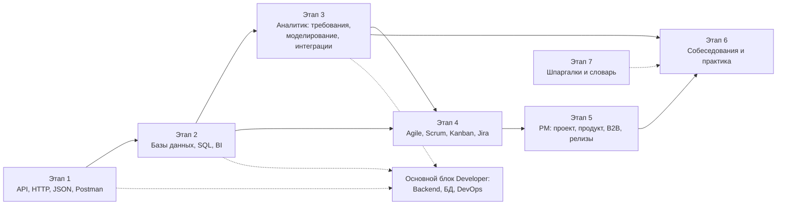

# Аналитика и PM

Вики для бизнес-аналитиков, системных аналитиков и менеджеров проектов и продуктов. Объясняет простым языком то, что нужно знать про API, данные и процессы, даже если вы не пишете код. Опирается на основной блок Developer: где нужно углубиться, темы ссылаются на него.

↑ [[00 Карта]]

> [!tip] Как проходить
> Начните с общего ядра (этапы 1 и 2): API, Postman, JSON, базы данных и SQL. Затем выберите ветку: аналитик (этап 3) или PM и продукт (этап 5). Этап 4 (Agile и управление) общий. Этап 6 для подготовки к собеседованию, этап 7 справочники.

> [!note] Скелет
> Структура и планы тем готовы, тексты ещё пишутся. Помеченные как «скелет» темы содержат план и ссылки; по мере наполнения метка `skeleton: true` убирается из свойств темы.

## Три маршрута

| Маршрут | Этапы | Для кого |
|---|---|---|
| Быстрый старт по API | разделы 1.1 → 1.2 → 1.5 → 1.6 | любой, кто не работал с API |
| Бизнес и системный аналитик | 1 → 2 → 3 → 4 → 6.1 | BA, SA, начинающие аналитики |
| PM, PO, менеджер продукта | 1 → 2 → 4 → 5 → 6.2 | менеджеры проектов и продуктов |

## Состав блока
- [[AN Этап 1 · API для чайников — HTTP, JSON, Postman|Этап 1 · API для чайников: HTTP, JSON, Postman]]: Всё про API с нуля для тех, кто не пишет код: что это, как вызывается, как читать ответ, как найти и проверить. Общее ядро для аналитика и PM.
- [[AN Этап 2 · Данные — базы, SQL и отчётность|Этап 2 · Данные: базы, SQL и отчётность]]: Аналитик и PM должны уметь доставать и понимать данные: базы, SQL, хранилища, BI, таблицы.
- [[AN Этап 3 · Бизнес- и системный анализ|Этап 3 · Бизнес- и системный анализ]]: Ветка аналитика (BA и SA): роль, требования, документы, моделирование, проектирование интеграций, тестирование, метрики, безопасность.
- [[AN Этап 4 · Agile и управление командой|Этап 4 · Agile и управление командой]]: Общий блок для PM, PO и аналитика: Agile, Scrum, Kanban, Jira, планирование, коммуникации.
- [[AN Этап 5 · Проекты, продукт и B2B|Этап 5 · Проекты, продукт и B2B]]: Ветка PM и продукта: проект, продуктовое мышление, B2B-рынок, релизы и эксплуатация, работа с разработкой.
- [[AN Этап 6 · Собеседования и практика|Этап 6 · Собеседования и практика]]: Подготовка к собеседованиям на роли BA, SA и PM, кейсы и практические проекты.
- [[AN Этап 7 · Справочники и словарь|Этап 7 · Справочники и словарь]]: Шпаргалки и словарь терминов для быстрого обращения.

## Этапы
<!-- toc:start -->
**Итого:** 233 тем · ~66 ч 57 мин · готово 0 из 233

| Этап | Приоритет | Чтение | Прогресс |
|---|---|---|---|
| [[AN Этап 1 · API для чайников — HTTP, JSON, Postman\|Этап 1 · API для чайников: HTTP, JSON, Postman]] | Обязательно | 5 ч 37 мин | 0 из 49 

 |
| [[AN Этап 2 · Данные — базы, SQL и отчётность\|Этап 2 · Данные: базы, SQL и отчётность]] | Обязательно | 8 ч 20 мин | 0 из 25 

 |
| [[AN Этап 3 · Бизнес- и системный анализ\|Этап 3 · Бизнес- и системный анализ]] | Обязательно | 18 ч 40 мин | 0 из 56 

 |
| [[AN Этап 4 · Agile и управление командой\|Этап 4 · Agile и управление командой]] | Обязательно | 13 ч | 0 из 39 

 |
| [[AN Этап 5 · Проекты, продукт и B2B\|Этап 5 · Проекты, продукт и B2B]] | Обязательно | 13 ч | 0 из 39 

 |
| [[AN Этап 6 · Собеседования и практика\|Этап 6 · Собеседования и практика]] | Обязательно | 5 ч | 0 из 15 

 |
| [[AN Этап 7 · Справочники и словарь\|Этап 7 · Справочники и словарь]] | Желательно | 3 ч 20 мин | 0 из 10 

 |
<!-- toc:end -->
