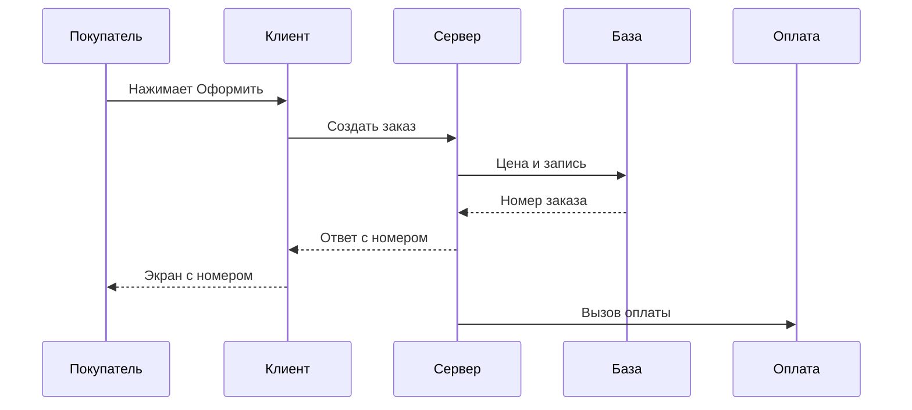

# Клиент, сервер, база и API: как устроено приложение

↑ [[AN 1.1 Что такое API и как устроены системы|1.1 Что такое API и как устроены системы]] · → [[AN 1.1.2 Что такое API простыми словами|Следующая]]

<!-- meta:start -->
<div class="meta-strip"><span class="badge must">Обязательно</span><span class="chip">~7 мин чтения</span><span class="chip">Уровень: junior</span></div>
<!-- meta:end -->

> [!info] Зачем это аналитику и PM
> Иначе легко обсуждать кнопку, хотя ломается запись заказа, или просить «поправить базу», хотя правило живёт на сервере. Схема слоёв помогает задать вопрос туда, где действительно будет изменение.

## План темы
- [x] клиентская и серверная часть
- [x] фронтенд и бэкенд
- [x] где хранятся данные
- [x] где живёт бизнес-логика
- [x] пример: заказ в интернет-магазине

## Объяснение

Приложение почти всегда состоит из интерфейса, который начинает запросы, программы с правилами и хранилища фактов. API (программный интерфейс) — обмен запросами и ответами между этими частями и чужими системами.

Как в магазине. Касса — клиент. Подсобка, где сверяют цену, — сервер. Журнал остатков — база. Окно между кассой и подсобкой — API: заказ передают через него, журнал покупателю не отдают.

### Клиент и сервер

Клиент начинает разговор: браузер, приложение, скрипт или другой сервис. Сервер проверяет запрос и отвечает. Клиенту нельзя верить целиком: цену в форме подменяют. Правило «можно ли оформить заказ» сервер считает сам, даже если экран уже показал галочку.

### Фронтенд и бэкенд

Фронтенд — страницы сайта. Бэкенд — заказы, оплата, роли на сервере. Мобильное приложение тоже клиент, но «задача на фронт» его не закрывает. Одна история часто делится на экран и на правило.

### Где хранятся данные

Заказы и остатки лежат в базе. Из интернета к ней ходит сервер, не браузер. Если два отчёта спорят, спросите, какая база и на какой момент считается источником правды.

### Где живёт бизнес-логика

«Не больше остатка» и «скидка только золоту» считают на сервере. Экран лишь подсказывает. Запрет только в интерфейсе обходят прямым вызовом. Где правило в вашем контуре, уточняйте у команды.

### Пример: заказ в интернет-магазине

«Оформить» отправляет корзину на API. Сервер заново читает цену, пишет заказ и возвращает номер. Оплата — отдельный вызов нашего сервера в чужой API. В одну секунду на экране, в базе и у платежа могут быть разные факты: показали, записали, внешний сервис ещё молчит.



| Слой | Что видит человек | Что уточнять |
|---|---|---|
| Клиент | Экран или приложение | Браузер, мобильное приложение или чужой сервис |
| Сервер | Успех или отказ | Кто принимает запрос и какое правило считает |
| База | История в кабинете | Где источник правды |
| Внешний сервис | Статус оплаты | Чей API и что будет, если он молчит |

## Примеры

Схема для постановки, не ответ магазина. Домен `example.com` зарезервирован под примеры.

```http
POST /orders HTTP/1.1
Host: api.example.com
Content-Type: application/json
Authorization: Bearer eyJ...
```

```json
{
  "orderId": "1042",
  "status": "created",
  "total": 2490
}
```

Учебный JSONPlaceholder показывает живой обмен. Это не ваш каталог, а заготовленные записи.

```bash
curl -sS "https://jsonplaceholder.typicode.com/todos/1"
```

```json
{
  "userId": 1,
  "id": 1,
  "title": "delectus aut autem",
  "completed": false
}
```

## Нюансы и подводные камни

- За одним адресом API может стоять несколько программ. На первой схеме достаточно четырёх блоков.
- Выгрузка из API и выгрузка из базы — разные доступы и разный риск для персональных данных.
- Админка тоже клиент. Права у неё могут быть шире, чем у личного кабинета.
- Общая база двух продуктов связывает их без контракта: чужая правка таблицы ломает вас молча.
- Надпись «Сохранено» на кнопке не доказывает запись. Между нажатием и базой бывают очередь и обрыв сети.

## Практика

Нарисуйте клиент, сервер, базу и один внешний сервис знакомого продукта. Подпишите, кто кого вызывает.

**Ожидаемый результат:** у человека нет стрелки прямо в базу. Внешний сервис соединён с вашим сервером. У сервера подписано одно правило, которое нельзя оставить только на экране.

## Вопросы с ответами

> [!question]- Чем клиент отличается от сервера?
> Клиент начинает запрос. Сервер проверяет его и отвечает. Одна и та же система бывает клиентом чужого API и сервером для своего экрана.

> [!question]- Фронтенд и клиент — одно и то же?
> Нет. Фронтенд — страницы в браузере. Мобильное приложение и чужой сервис тоже клиенты, но задачей «на фронт» их не закрыть.

> [!question]- Почему правило нельзя оставить только на экране?
> Запрос к API собирают мимо формы. Деньги, остаток и права сервер проверяет сам в момент записи.

> [!question]- База уже является API?
> Нет. База хранит факты. API говорит другим программам, какие операции разрешены и какой придёт ответ.

## Связано с блоком Developer

- [[FE 1.1.5 Что происходит при вводе URL|1.1.5 Что происходит при вводе URL]]
- [[BE 8.3.1 Монолит или микросервисы — когда что|8.3.1 Монолит или микросервисы — когда что]]
- [[DB 1.1.1 Реляционная модель — таблицы, ключи, связи, ограничения|Реляционная модель — таблицы и связи]]

## Связанные темы

- [[AN 1.1.2 Что такое API простыми словами|Что такое API]]
- [[AN 1.1.5 Синхронные и асинхронные вызовы|Синхронные и асинхронные вызовы]]
- [[AN 1.2.1 Запрос и ответ — из чего состоит HTTP-сообщение|Из чего состоит HTTP-сообщение]]
