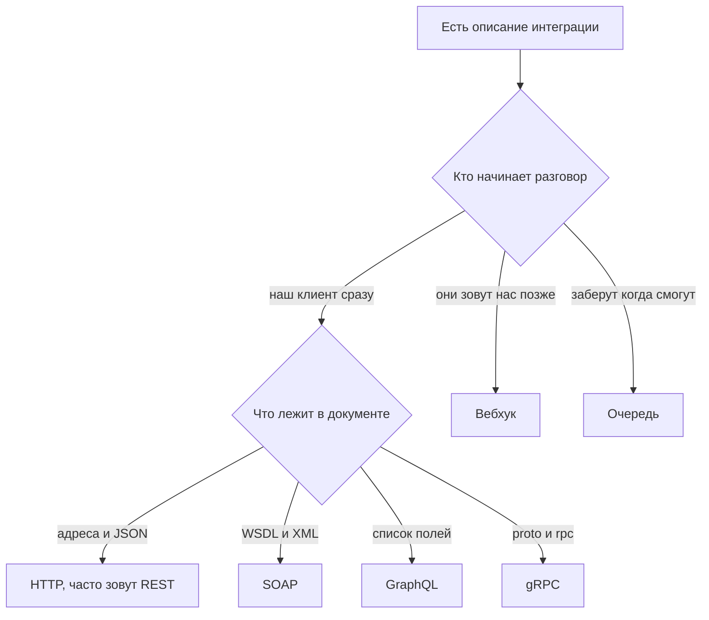

# Виды API: REST, SOAP, GraphQL, gRPC, вебхуки, очереди

↑ [[AN 1.1 Что такое API и как устроены системы|1.1 Что такое API и как устроены системы]] · ← [[AN 1.1.2 Что такое API простыми словами|Предыдущая]] · → [[AN 1.1.4 Окружения и стенды — dev, test, stage, prod|Следующая]]

<!-- meta:start -->
<div class="meta-strip"><span class="badge must">Обязательно</span><span class="chip">~7 мин чтения</span><span class="chip">Уровень: junior</span></div>
<!-- meta:end -->

> [!info] Зачем это аналитику и PM
> В одной интеграции команда говорит «REST», партнёр присылает XML, а оплата приходит отдельным вызовом на наш адрес. Если виды не различать, в срок попадает не тот объём работ и не те инструменты проверки.

## План темы
- [x] чем отличаются
- [x] где что встречается
- [x] как понять по документации, какой перед вами

## Объяснение

Вид API — способ оформить один смысл «передать или запросить факт»: текстом по адресам, XML-конвертом, выбором полей, бинарным вызовом, обратным вызовом или сообщением в очередь.

Похоже на доставку документов. У REST отдельные ящики по делам. SOAP — бланк, где каждое поле стоит на своём месте. GraphQL — окно, куда приносят список «нужны только эти графы». gRPC — внутренняя почта, бланк которой читает специальный аппарат. Вебхук — курьер сам стучится, когда документ готов. Очередь — лоток «разберём, когда освободимся».

### Чем отличаются и где встречаются

| Вид | Как устроен обмен | Где часто видят | Признак в документе |
|---|---|---|---|
| HTTP, его часто называют REST | Адрес на сущность, обычно JSON | Кабинеты, мобильные приложения, публичные API | Пути, GET и POST, примеры JSON |
| SOAP | XML-конверт и список операций | Банки, госсистемы, старые шины | WSDL, тела с тегами |
| GraphQL | Один адрес, клиент перечисляет поля | Экраны с разным составом данных | query, mutation, схема типов |
| gRPC | Вызов по бинарному контракту | Связь сервисов внутри компании | Файл .proto, слова rpc и protobuf |
| Вебхук | Чужая система вызывает наш адрес | Оплата, подпись, доставка | «Пришлём POST на ваш URL» |
| Очередь | Сообщение лежит, пока его не заберут | Письма, отчёты, пики заказов | Topic, queue, consumer |

REST в речи команды чаще значит «JSON по HTTP», а не строгий учебный стиль. SOAP описывают файлом WSDL, данные везут в XML. GraphQL отдаёт запрошенные поля, но отказ в доступе выглядит иначе, чем у обычного HTTP: это стоит спросить отдельно. gRPC неудобно читать глазами, для постановки берут имена методов и полей.

Вебхук и очередь — не другой формат тела, а другая сторона, которая начинает разговор. При вебхуке итог приходит позже на наш адрес. При очереди отправитель не знает, кто и когда прочитает сообщение.

### Как узнать вид по бумаге

Смотрите на артефакт, не на заголовок слайда.

- Таблица адресов и JSON — HTTP, который назовут REST.
- WSDL и конверт XML — SOAP.
- Один вход и список полей в запросе — GraphQL.
- Файл `.proto` — gRPC.
- «Укажите ваш URL» — вебхук: наш сервер принимает чужой вызов.
- «Кладём событие, склад читает лоток» — очередь. Ответа в ту же секунду может не быть.

Один сценарий часто смешивает виды. Кабинет создаёт заказ по HTTP, склад читает очередь, партнёр бьёт вебхуком.



## Примеры

Учебный вызов JSONPlaceholder — JSON по HTTP, не SOAP и не очередь.

```bash
curl -sS "https://jsonplaceholder.typicode.com/posts/1"
```

Ниже укороченный вид ответа: у живого сервиса поле `body` длиннее. Для узнавания вида достаточно того, что это объект JSON.

```json
{
  "userId": 1,
  "id": 1,
  "title": "sunt aut facere repellat provident occaecati excepturi optio reprehenderit"
}
```

Остальное — схемы для постановки, не ответы банков и не живой GraphQL.

```text
query {
  order(id: "1042") {
    status
    total
  }
}
```

```text
Envelope
  Body
    CancelOrder
      OrderId 1042
```

```json
{
  "event": "payment.succeeded",
  "orderId": "1042"
}
```

У очереди такого ответа вызывающему может не быть. Тогда фиксируют имя события, поля сообщения и статус, который видит человек, пока лоток ещё не прочитали.

## Нюансы и подводные камни

- Надпись REST не доказывает стиль. Проверяйте адреса и примеры. Иногда так называют один общий адрес на все операции.
- Клиент GraphQL не должен получать поле только потому, что умеет его назвать. Доступ спрашивают отдельно.
- Если обещают «документацию в Swagger», уточните, что это не внутренний gRPC без текстового описания.
- Вебхук требует доступный адрес, проверку отправителя и готовность получить то же событие дважды.
- Очередь не рисует экран «готово» в ту же секунду. Нужны статус «принято» и способ узнать итог.

## Практика

Разложите три обмена: создание заказа, уведомление об оплате, письмо клиенту. Для каждого укажите вид и кто начинает разговор.

**Ожидаемый результат:** у строки есть подтверждение из документа (адрес и JSON, WSDL, «пришлём на URL» или имя очереди). Если подтверждения нет, стоит вопрос владельцу, а не ярлык «REST» наугад.

## Вопросы с ответами

> [!question]- Почему фразы «сделайте REST» мало?
> Так часто называют любой JSON по HTTP. Для срока важнее, кто кого вызывает и нужен ли итог сразу.

> [!question]- Чем вебхук отличается от запроса нашего экрана?
> Экран сам ждёт ответ. Вебхук начинает партнёр, когда событие уже случилось, и зовёт наш адрес. Нужны задержка и повтор.

> [!question]- Когда уместна очередь?
> Когда работу можно закончить позже: письмо, тяжёлый отчёт, склад в пик. Человеку показывают «принято». Если без итога нельзя идти дальше по экрану, одной очереди мало.

> [!question]- Как отличить SOAP от JSON API?
> У SOAP ищут WSDL и XML, у JSON API — пути и примеры объектов. Заголовок «веб-сервис» бывает у обоих.

## Связано с блоком Developer

- [[BE 1.1.5 Стили API — REST, RPC, GraphQL, WebSocket, SSE|1.1.5 Стили API — REST, RPC, GraphQL, WebSocket, SSE]]
- [[BE 5.2 gRPC|5.2 gRPC]]
- [[BE 5.3 GraphQL на бэкенде и Federation|5.3 GraphQL на бэкенде и Federation]]

## Связанные темы

- [[AN 1.1.2 Что такое API простыми словами|Что такое API]]
- [[AN 1.1.5 Синхронные и асинхронные вызовы|Синхронные и асинхронные вызовы]]
- [[AN 1.4.5 XML и SOAP для чтения|XML и SOAP для чтения]]
- [[AN 1.8.3 Вебхуки, очереди и события простыми словами|Вебхуки, очереди и события]]
