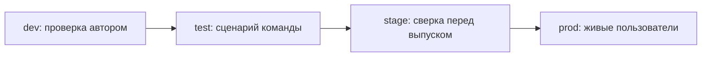

# Окружения и стенды: dev, test, stage, prod

↑ [[AN 1.1 Что такое API и как устроены системы|1.1 Что такое API и как устроены системы]] · ← [[AN 1.1.3 Виды API — REST, SOAP, GraphQL, gRPC, вебхуки, очереди|Предыдущая]] · → [[AN 1.1.5 Синхронные и асинхронные вызовы|Следующая]]

<!-- meta:start -->
<div class="meta-strip"><span class="badge must">Обязательно</span><span class="chip">~5 мин чтения</span><span class="chip">Уровень: junior</span></div>
<!-- meta:end -->

> [!info] Зачем это аналитику и PM
> Один и тот же метод на тестовом адресе и на боевом — это разные данные, разные ключи и разная цена ошибки. Путаница стендов даёт ложную приёмку или правку там, где сидят живые пользователи.

## План темы
- [x] зачем несколько окружений
- [x] чем отличаются данные и доступы
- [x] как не сломать продакшен
- [x] где проверять изменения

## Объяснение

Окружение, или стенд, — отдельный экземпляр системы со своим адресом, своей базой и своими доступами. Код может совпадать, последствия вызова — нет.

Как спектакль. Репетиция в пустом зале — черновик. Прогон для своих проверяет, что сцены стыкуются. Премьера — продакшен: ошибка уже публичная.

### Зачем несколько стендов

На машине разработчика сервис перезапускают часто, данные выдуманы, соседей заменяют заглушками. Общий тестовый стенд нужен, чтобы сценарий могли повторить тестировщик и аналитик. Стенд, похожий на бой, ловит неверные адреса партнёров и забытые настройки. Бой обслуживает настоящих пользователей. Сырую идею там проверять негде: отмена уже ушла клиенту.

Имена не универсальны. Где-то говорят dev, test, stage, prod, где-то QA, UAT, preprod.

| Стенд | Обычная роль | Данные | Цена ошибки |
|---|---|---|---|
| dev | Черновик автора | Синтетические, их часто сбрасывают | Ломается проверка автора |
| test | Общие сценарии | Кейсы, не живые клиенты | Портится общий контур |
| stage | Сверка перед выпуском | По форме как бой, без лишних копий людей | Легко перепутать с боем |
| prod | Работа пользователей | Настоящие заказы | Ошибка видна наружу |



Стрелки — частый порядок, не закон. Маленькая команда живёт без stage. Смысл один: место, где можно ошибиться, отделено от места, где ошибка стоит денег.

### Данные и доступы

На нижних стендах заводят вымышленных людей и учебные карты, которые выдал партнёр. Боевые ключи и выгрузки живых клиентов туда не копируют «для похожести».

Запись в бой тем же клиентом, которым ходили в test, — частая авария. У каждого стенда свой адрес и свой набор переменных.

### Где проверять и как не задеть прод

Изменение контракта смотрят там, куда выложили задачу, обычно на test. Stage нужен, когда важны настройки и миграции перед выпуском. Prod — для наблюдения после выпуска и разбора уже случившегося, не для опыта «что будет, если удалить».

Перед вызовом сверьте адрес, имя окружения, учётные данные и чья база получит запись. Если один пункт про бой, остановитесь. Удаление, оплата и рассылка в сомнительном контуре — не маленькая проверка.

## Примеры

Адреса ниже — схема на домене `example.com`. У команды будут другие хосты. В рабочую коллекцию их не подставляют как настоящие.

```text
dev    https://dev.example.com/orders
test   https://test.example.com/orders
stage  https://stage.example.com/orders
prod   https://api.example.com/orders
```

JSONPlaceholder учит читать ответ и не заменяет приёмку вашего релиза: там нет ваших правил.

```bash
curl -sS "https://jsonplaceholder.typicode.com/todos/1"
```

В клиенте запросов адрес лучше держать переменной. Боевой секрет в общий файл не кладут.

```text
baseUrl = https://test.example.com
token = ***
```

## Нюансы и подводные камни

- Одинаковый путь метода не значит одинаковое поведение: на test скидку может считать заглушка.
- Редко обновляемый stage врёт увереннее test: там старая сборка и зелёные проверки.
- Общая тестовая база — общий ресурс. «Очистить заказы» стирает данные коллеги.
- Заглушка на test не доказывает, что партнёр примет то же поле. Для этого нужна их песочница.

## Практика

Составьте таблицу стендов продукта: имя в команде, адрес API, чьи данные, можно ли вам писать. Пустую ячейку не заполняйте догадкой.

**Ожидаемый результат:** prod отделён адресом и правом записи. У тестового контура сказано, учебные ли данные и какая песочница партнёра к нему подключена. Неизвестное отмечено вопросом, а не выдумкой.

## Вопросы с ответами

> [!question]- Почему задачу не принимают сразу на prod?
> Там настоящие пользователи. Сначала сценарий проходит там, где запись можно испортить без клиента. Бой остаётся для выпуска и разбора фактов.

> [!question]- Stage и test — это всегда разные серверы?
> Нет. Число стендов и имена локальные. Сверяйтесь с адресом и словарём команды, не с чужой статьёй.

> [!question]- Чем опасен один ключ на все стенды?
> Легко ударить в бой, думая, что выбран test. У каждого окружения свои переменные, боевой секрет не лежит в выгружаемом файле коллекции.

> [!question]- Можно ли скопировать базу prod на test?
> Не как обычный шаг. В копии персональные данные и платёжные следы. Для проверки хватает вымышленных персонажей. Слепок решает безопасность.

## Связано с блоком Developer

- [[DO 3.8 Секреты и окружения — dev, staging, prod|3.8 Секреты и окружения — dev, staging, prod]]

## Связанные темы

- [[AN 1.5.3 Переменные и окружения (environments)|Переменные и окружения в Postman]]
- [[AN 1.8.6 B2B-интеграции — песочница, тестовые данные, SLA|Песочница и тестовые данные]]
- [[AN 1.3.5 Безопасность для аналитика — что нельзя светить|Что нельзя светить]]
- [[AN 1.1.6 Как найти API — документация, Swagger UI, DevTools, коллекции|Как найти API]]
