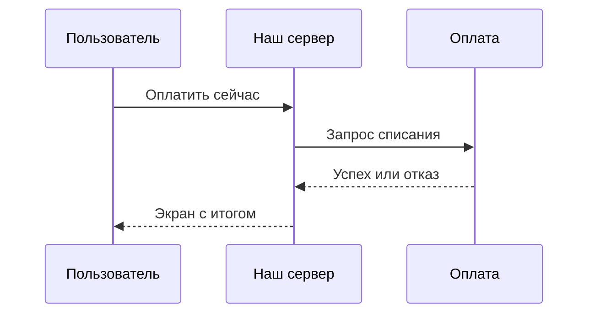
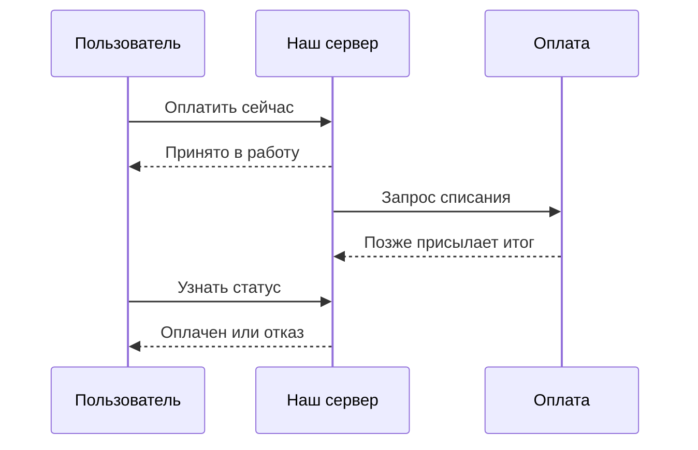

# Синхронные и асинхронные вызовы

↑ [[AN 1.1 Что такое API и как устроены системы|1.1 Что такое API и как устроены системы]] · ← [[AN 1.1.4 Окружения и стенды — dev, test, stage, prod|Предыдущая]] · → [[AN 1.1.6 Как найти API — документация, Swagger UI, DevTools, коллекции|Следующая]]

<!-- meta:start -->
<div class="meta-strip"><span class="badge must">Обязательно</span><span class="chip">~7 мин чтения</span><span class="chip">Уровень: junior</span></div>
<!-- meta:end -->

> [!info] Зачем это аналитику и PM
> От способа вызова зависят текст на экране и срок в сценарии. Если оплата не отвечает в том же запросе, фраза «кнопка сразу показывает успех» описывает поведение, которого нет.

## План темы
- [x] запрос-ответ
- [x] очереди и события
- [x] вебхуки
- [x] polling
- [x] как это влияет на сценарий и тайминги

## Объяснение

Синхронный вызов — вопрос у стойки: отправитель ждёт ответ и только потом идёт дальше. Асинхронный — заявка: вам выдали номер, итог придёт отдельно.

В мастерской синхронный путь — вы стоите, пока при вас смотрят застёжку. Асинхронный — «оставили, позвоним». Очередь — лоток на столе мастера. Вебхук — мастер звонит сам. Polling, опрос, — вы набираете мастерскую снова и снова.

### Запрос и ответ

Клиент держит экран, пока не придут успех или отказ. Так проверяют короткое: хватает ли остатка, верен ли код. В требованиях фиксируют, сколько ждать и что показать при молчании. Молчание — не отказ банка и не успех.

### Очереди, события и вебхуки

Очередь хранит сообщение, пока получатель его не заберёт. Событие сообщает факт, который уже случился: «заказ создан». Кто не подписан, тот сам не узнает.

Вебхук — обратный HTTP-вызов. Партнёр сам бьёт в адрес, который мы назвали. Пользователь к этому моменту мог закрыть вкладку, поэтому статус хранят на сервере. Одно уведомление иногда приходит дважды. Нужен признак, что вызов правда от партнёра.

### Опрос и тайминги сценария

Опрос выбирают, когда нас некому позвать. Клиент раз в несколько секунд спрашивает статус заявки. Это не требует входящего адреса, но создаёт нагрузку и опаздывает на один интервал. Нужны пауза, момент остановки и текст ожидания.

| Способ | Кто ждёт | Что видит человек | Что заложить |
|---|---|---|---|
| Синхронный запрос | Отправитель до ответа | Итог на том же шаге | Предел ожидания и текст, если связи нет |
| Очередь или событие | Никто не стоит над обработчиком | «Принято», итог позже | Статус и поведение при сбое потребителя |
| Вебхук | Партнёр позовёт сам | Итог после внешнего события | Наш адрес и повтор уведомления |
| Опрос | Клиент спрашивает снова | Итог на очередном запросе | Интервал и предел попыток |

Для шага ответьте: нужен ли итог, чтобы открыть следующий экран, кто приносит итог и что правда через минуту молчания.





Первая схема обещает итог в том же ожидании. Вторая честно пишет «принято», а «оплачено» появляется отдельным шагом.

## Примеры

Публичный httpbin умеет задержать ответ. Это иллюстрация синхронной паузы, не ваш банк. Состав тела смотрите у сервиса.

```bash
curl -sS "https://httpbin.org/delay/1"
```

Схема асинхронной оплаты для постановки, не ответ платёжной системы.

```json
{
  "orderId": "1042",
  "paymentStatus": "accepted"
}
```

Пока статус `accepted`, экран не пишет «оплачено». Итог приходит вебхуком или опросом. Имена статусов ниже учебные, в вашем контракте будут другие.

```text
GET /orders/1042
повторять, пока статус не станет итогом
интервал задаёт команда, не эта заметка
```

## Нюансы и подводные камни

- «Заявка принята» и «деньги списаны» — разные факты. Им нужны разные слова на экране.
- Повтор кнопки после таймаута может создать второй платёж. Напишите, что делать со вторым таким же запросом.
- Вебхук приходит и раньше экрана, и после закрытия вкладки. Память страницы — плохой источник статуса.
- Повторная доставка уведомления не должна второй раз отгружать тот же заказ.

## Практика

Разложите «оплатить заказ» на синхронный и асинхронный столбцы: что видно в первые секунды, откуда берётся итог, что показано, если партнёр молчит.

**Ожидаемый результат:** в синхронном столбце итог приходит в том же ожидании. В асинхронном сначала написано «принято», а «оплачено» — только после вебхука или опроса. Молчание в обоих столбцах не названо отказом банка.

## Вопросы с ответами

> [!question]- Что видит человек при синхронном и при асинхронном вызове?
> В первом случае он дожидается итога на том же шаге. Во втором получает «заявку взяли», а итог узнаёт позже по статусу. Эти подписи нельзя менять местами.

> [!question]- Вебхук — это очередь?
> Нет. Вебхук — входящий запрос на наш адрес. Очередь читает получатель, когда готов. У вебхука ломается наш адрес, у очереди — потребитель.

> [!question]- Зачем опрос, если есть вебхук?
> Опрос не требует входящего адреса. Платой будут лишние запросы и задержка на интервал. Два канала без правила, какой из них главный, дают два разных статуса.

## Связано с блоком Developer

- [[BE 5.4.1 Зачем асинхронный обмен — очереди, pub-sub, события|5.4.1 Зачем асинхронный обмен — очереди, pub-sub, события]]
- [[BE 8.3.4 Синхронное и асинхронное взаимодействие сервисов|8.3.4 Синхронное и асинхронное взаимодействие сервисов]]

## Связанные темы

- [[AN 1.1.3 Виды API — REST, SOAP, GraphQL, gRPC, вебхуки, очереди|Виды API]]
- [[AN 1.8.3 Вебхуки, очереди и события простыми словами|Вебхуки, очереди и события]]
- [[AN 1.8.4 Ошибки интеграций — таймауты, повторы, дубли|Таймауты, повторы, дубли]]
- [[AN 1.2.4 Коды ответов — 2xx, 3xx, 4xx, 5xx|Коды ответов HTTP]]
