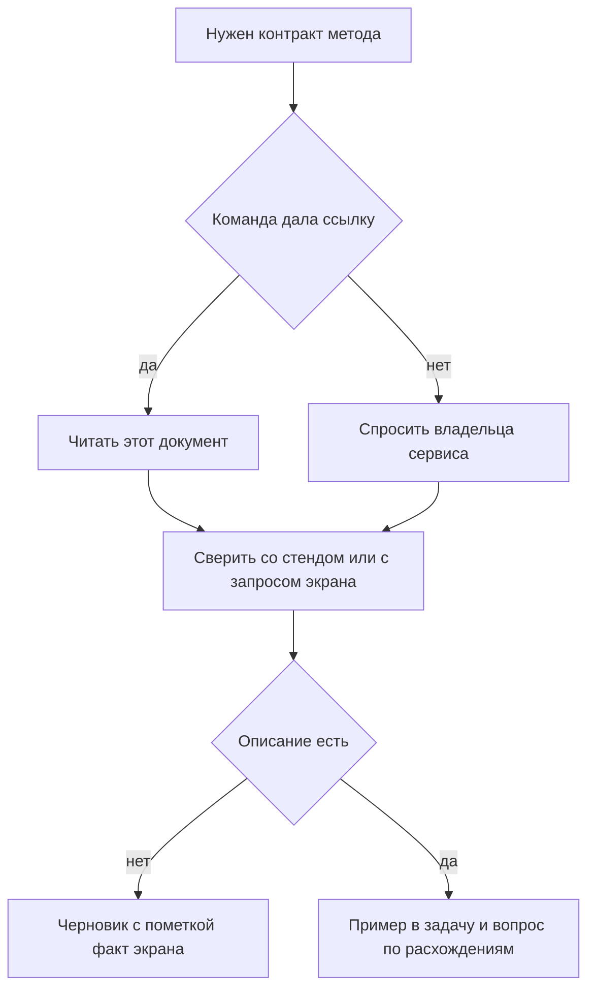

# Как найти API: документация, Swagger UI, DevTools, коллекции

↑ [[AN 1.1 Что такое API и как устроены системы|1.1 Что такое API и как устроены системы]] · ← [[AN 1.1.5 Синхронные и асинхронные вызовы|Предыдущая]]

<!-- meta:start -->
<div class="meta-strip"><span class="badge must">Обязательно</span><span class="chip">~7 мин чтения</span><span class="chip">Уровень: junior</span></div>
<!-- meta:end -->

> [!info] Зачем это аналитику и PM
> Описание метода редко лежит одним файлом. Нужно найти контракт, отличить его от фактического запроса экрана и понять, у кого просить доступ, иначе переписка «пришлите ещё раз тот JSON» растягивается на дни.

## План темы
- [x] где искать описание
- [x] публичные коллекции Postman
- [x] как понять, какие запросы делает приложение
- [x] к кому идти за доступом

## Объяснение

Найти API — собрать проверяемые сведения о методе: адрес, поля, пример ответа, стенд и того, кто имеет право контракт менять. Берут тот источник, который команда считает правдой.

Как расписание поликлиники. На сайте одна таблица, в регистратуре другая, табло показывает фактический приём. Документация, Swagger UI и запрос браузера — три таких источника.

### Где искать описание

Начните со ссылки автора задачи: страница в базе знаний или файл спецификации. Если ссылки нет, спросите владельца сервиса. Спецификацию HTTP API часто отдают в формате OpenAPI. Swagger UI — экран поверх неё: пути, поля и пробный вызов. Словом «Swagger» называют и этот экран, и старое имя спецификации. Что прислали, видно по файлу.

| Источник | Что взять | Чего не ждать |
|---|---|---|
| Страница в вики | Смысл и ограничения сценария | Что поля не устарели |
| Swagger UI и OpenAPI | Путь, поля, пример тела | Матрицу ролей и весь сценарий |
| Коллекция запросов | Пример, который уже запускали | Что автор — владелец API |
| Вкладка сети в браузере | Фактический вызов экрана | Методы, до которых экран не доходит |
| Владелец сервиса | Стенд и доступ | Ответ без имени метода |

### Коллекции и запросы экрана

Коллекция в Postman — папка готовых запросов. Публичные ищут по имени сервиса. Чужой файл бывает устаревшим или чужим черновиком. Смотрят издателя и сверяют один метод с официальным описанием. Импорт спецификации вашей команды надёжнее случайной коллекции.

Чтобы увидеть вызовы своего экрана, откройте тестовый стенд и панель разработчика браузера, вкладку сети. Повторите действие и отделите API от картинок. Это факт интерфейса, не каталог сервера: фоновые интеграции в браузере не появятся. Запрос можно скопировать как curl в баг, вырезав заголовок доступа и cookie. В тексте достаточно маски `Bearer eyJ...`.

### У кого просить доступ

Доступ просят у владельца сервиса или у того, кого он назвал. В письме нужны стенд, метод или сценарий, зачем доступ и на какой срок. «Дайте доступ к API» без этого возвращается встречным вопросом. Для чтения контракта боевая запись обычно не нужна.



## Примеры

JSONPlaceholder вызывается без ключа. Это учебная проверка чтения, не поиск вашего внутреннего API.

```bash
curl -sS "https://jsonplaceholder.typicode.com/todos/1" -H "Accept: application/json"
```

```json
{
  "userId": 1,
  "id": 1,
  "title": "delectus aut autem",
  "completed": false
}
```

Схема внутреннего вызова. Хост учебный, токен закрыт. На боевой адрес эту строку не отправляют.

```http
GET /orders/1042 HTTP/1.1
Host: test.example.com
Accept: application/json
Authorization: Bearer eyJ...
```

У сообщества OpenAPI есть учебный Petstore: спецификация, по которой обычно показывают Swagger UI. Адрес демонстрации менялся, берите его из документации проекта. В компании ориентир другой — страница владельца сервиса. В обоих случаях с карточки выписывают одно и то же.

```text
метод и путь: GET /todos/1
стенд: публичный учебный JSONPlaceholder
поле для экрана: title
чего нет в примере: ошибок и прав доступа
```

## Нюансы и подводные камни

- Пробный вызов в Swagger UI бьёт в сервер, выбранный на странице. Случайный prod выполнит запрос по-настоящему.
- Пустой список в ответе может быть нормой стенда, а не поломкой метода.
- В баг не кладут сырой дамп с секретом. Нужны путь, значимые поля и код ответа.
- Коллекция без стенда почти наверняка смотрит на чужой dev.

## Практика

На JSONPlaceholder или на вашем test найдите один метод чтения. Выпишите метод, путь, одно поле и источник.

**Ожидаемый результат:** строка вроде «GET /todos/1, поле title, источник — публичный JSONPlaceholder» либо то же про ваш test со ссылкой для коллеги. Боевого токена рядом нет. Для внутреннего метода указан стенд, не только путь.

## Вопросы с ответами

> [!question]- Что открывать первым: Swagger UI или вики?
> То, на что сослался владелец. Swagger удобен для путей и полей, вики — для смысла. При расхождении не выбирайте наугад.

> [!question]- Можно ли верить публичной коллекции?
> После сверки издателя и одного метода с официальным описанием. Файл устаревает и бывает от другого стенда. Свой API надёжнее импортировать из спецификации команды.

> [!question]- Как увидеть запросы нашего экрана?
> Тестовый стенд, панель разработчика, вкладка сети, повторить действие. Отделите API от картинок. Это действия экрана, не весь сервер.

> [!question]- Что писать в просьбе о доступе?
> Стенд, метод или сценарий, зачем доступ и нужен ли он на запись. Фраза «дайте API» не говорит, выдавать ключ test или открывать prod.

## Связано с блоком Developer

- [[BE 5.1.6 Публичный API — документация, лимиты, ключи|5.1.6 Публичный API — документация, лимиты, ключи]]

## Связанные темы

- [[AN 1.6.1 Как читать документацию API|Как читать документацию API]]
- [[AN 1.6.2 OpenAPI и Swagger UI — структура спецификации|OpenAPI и Swagger UI]]
- [[AN 1.7.1 DevTools браузера — вкладка Network|Вкладка Network]]
- [[AN 1.5.8 Импорт и экспорт — cURL, OpenAPI, Swagger|Импорт cURL и OpenAPI]]
- [[AN 1.3.5 Безопасность для аналитика — что нельзя светить|Что нельзя светить]]
