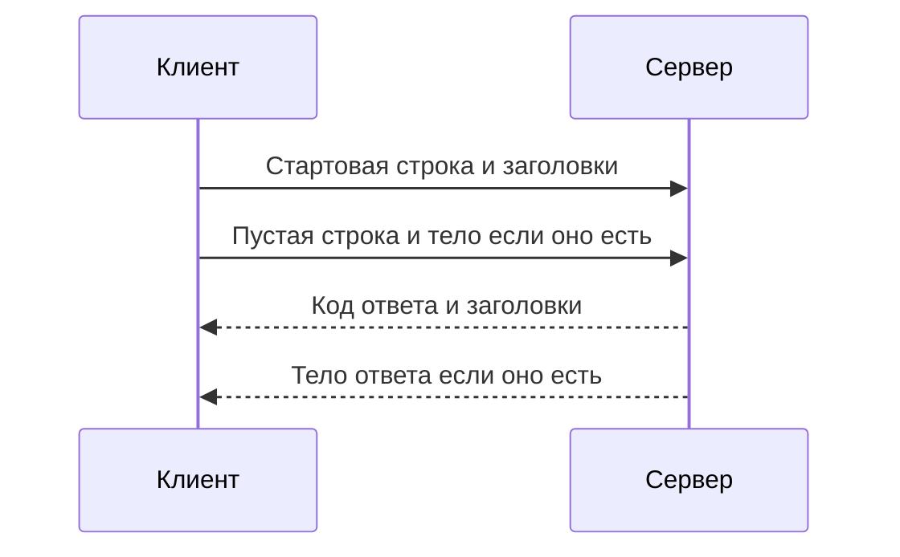

# Запрос и ответ: из чего состоит HTTP-сообщение

↑ [[AN 1.2 HTTP и REST для не-разработчиков|1.2 HTTP и REST для не-разработчиков]] · → [[AN 1.2.2 URL — адрес, path, query-параметры|Следующая]]

<!-- meta:start -->
<div class="meta-strip"><span class="badge must">Обязательно</span><span class="chip">~7 мин чтения</span><span class="chip">Уровень: junior</span></div>
<!-- meta:end -->

> [!info] Зачем это аналитику и PM
> Жалоба «не сохранилось» почти всегда упирается в конкретное сообщение: что ушло на сервер и что вернулось. Пока запрос не разобран на части, пустой экран легко спутать с отказом в правиле или со сбоем сети.

## План темы
- [x] стартовая строка
- [x] заголовки
- [x] тело
- [x] пример реального запроса и ответа

## Объяснение

HTTP-сообщение — это запрос или ответ по протоколу HTTP (Hypertext Transfer Protocol, протокол передачи гипертекста): стартовая строка, заголовки и необязательное тело. Этим языком говорят браузер, мобильное приложение и почти любой веб-API.

Как бланк в окошке. Первая строка говорит, что вы просите или чем дело кончилось. Штампы на полях — заголовки: формат, допуск, размер. Лист внутри — тело с данными задачи. Пустая строка отделяет штампы от листа. Без неё получатель не понимает, где кончились служебные поля.

### Стартовая строка

У запроса в ней три куска: метод, путь и версия протокола. Метод — операция, путь — какой ресурс, версия — по каким правилам читать дальше.

```http
GET /orders/1042 HTTP/1.1
```

У ответа вместо метода стоят версия, трёхзначный код и короткая причина. Решение принимают по коду. Слова `OK` или `Not Found` — подпись для человека, не отдельный контракт. В HTTP/2 и HTTP/3 ту же тройку возят в двоичном виде. Во вкладке сети вы всё равно видите метод, путь и код: инструменты показывают их текстом.

### Заголовки

Дальше идут строки `Имя: значение`, каждая с новой строки. Здесь лежат тип тела, какой ответ клиент готов принять, и допуск. Регистр имени обычно не важен, но в переписке лучше копировать заголовок как в примере команды. Смысл частых полей разобран в теме про заголовки. Пока достаточно видеть границу: заголовок — не поле заказа, а служебная пометка к сообщению.

### Тело

Тело есть не всегда. «Покажи заказ» часто уходит без тела, ответ со списком почти всегда с телом. Пустая строка перед телом обязательна и тогда, когда тела нет: она закрывает список заголовков. В баге пишите отдельно, о каком теле речь. Тело запроса — то, что отправили. Тело ответа — то, что вернулось. Их путают, когда в обоих есть JSON с полем `status`.



| Часть | В запросе | В ответе |
|---|---|---|
| Старт | Метод, путь, версия | Версия, код, короткая причина |
| Заголовки | Тип, допуск, какой ответ ждут | Тип тела, размер, служебные пометки |
| Тело | Данные действия, часто JSON | Заказ, список или текст ошибки |

## Примеры

Ниже схема сообщения на учебном домене `example.com`, не снимок вашего боя. Токен закрыт маской.

```http
POST /orders HTTP/1.1
Host: api.example.com
Content-Type: application/json
Authorization: Bearer eyJ...

{"sku": "MUG-1", "qty": 2}
```

Ответ на создание часто выглядит так. Это схема: код `201` команда может заменить своим правилом.

```http
HTTP/1.1 201 Created
Content-Type: application/json

{"orderId": "1042", "status": "created"}
```

Живой обмен без ключа даёт учебный JSONPlaceholder. Команда только читает заранее заготовленную запись. Разберите в ответе стартовый код, заголовок типа и тело.

```bash
curl -sS -D - "https://jsonplaceholder.typicode.com/todos/1" -o /tmp/todo.json
```

Типичное тело этого метода:

```json
{
  "userId": 1,
  "id": 1,
  "title": "delectus aut autem",
  "completed": false
}
```

## Нюансы и подводные камни

- Код успеха и текст ошибки в теле иногда приходят вместе. Читайте оба слоя, не выбирайте один.
- В HTTP/1.1 заголовок `Host` обязателен. Без него сервер имеет право ответить отказом ещё до ваших полей.
- Красивый перенос в редакторе — не конец строки протокола. В сыром HTTP/1.1 строки заканчиваются парой «возврат каретки и перевод строки».

## Практика

На тестовом стенде или на JSONPlaceholder откройте один запрос во вкладке сети. Выпишите стартовую строку запроса, код ответа, один заголовок и есть ли тело.

**Ожидаемый результат:** четыре строки, например метод `GET`, путь `/todos/1`, код `200`, заголовок `content-type` и пометка «тело есть». Секрета в выписке нет.

## Вопросы с ответами

> [!question]- Из чего состоит HTTP-сообщение?
> Из стартовой строки, заголовков и необязательного тела. Заголовки от тела отделяет пустая строка. Так устроен и запрос, и ответ.

> [!question]- Где написано, удался ли вызов?
> В стартовой строке ответа, в трёхзначном коде. Текст рядом и JSON в теле поясняют детали, но не заменяют код, если команда договорилась иначе и это прямо не записано.

> [!question]- Чем заголовок отличается от поля заказа?
> Заголовок описывает само сообщение: формат, допуск, размер. Поле заказа лежит в теле или в адресе. В постановке их лучше не смешивать в один список.

## Связано с блоком Developer

- [[BE 1.1.2 HTTP для бэкенда — методы, статусы, заголовки, keep-alive, HTTP-2 и HTTP-3|1.1.2 HTTP для бэкенда — методы, статусы, заголовки, keep-alive, HTTP-2 и HTTP-3]]
- [[FE 1.1.2 HTTP-HTTPS — методы, статусы, заголовки, HTTP-2 и HTTP-3|1.1.2 HTTP-HTTPS — методы, статусы, заголовки, HTTP-2 и HTTP-3]]
- [[BE 1.1.7 Запрос по TCP руками — nc, telnet, openssl s_client, HTTP и Redis|1.1.7 Запрос по TCP руками — nc, telnet, openssl s_client, HTTP и Redis]]

## Связанные темы

- [[AN 1.2.2 URL — адрес, path, query-параметры|Адрес URL]]
- [[AN 1.2.5 Заголовки — Content-Type, Accept, Authorization и другие|Заголовки]]
- [[AN 1.7.1 DevTools браузера — вкладка Network|Вкладка Network]]
