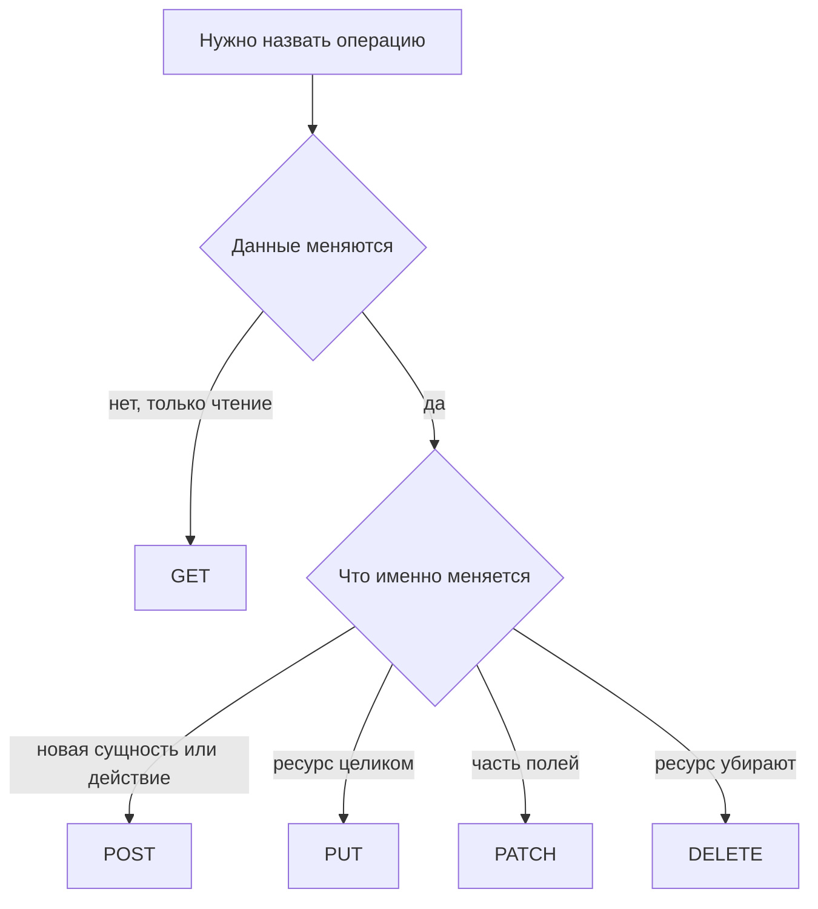

# Методы GET, POST, PUT, PATCH, DELETE

↑ [[AN 1.2 HTTP и REST для не-разработчиков|1.2 HTTP и REST для не-разработчиков]] · ← [[AN 1.2.2 URL — адрес, path, query-параметры|Предыдущая]] · → [[AN 1.2.4 Коды ответов — 2xx, 3xx, 4xx, 5xx|Следующая]]

<!-- meta:start -->
<div class="meta-strip"><span class="badge must">Обязательно</span><span class="chip">~7 мин чтения</span><span class="chip">Уровень: junior</span></div>
<!-- meta:end -->

> [!info] Зачем это аналитику и PM
> Один и тот же адрес заказа может и показать карточку, и стереть её. Метод — это и есть выбор операции. Ошибка в методе превращает «повторить запрос» в второй платёж или в затирание полей.

## План темы
- [x] что делает каждый
- [x] безопасные и идемпотентные методы
- [x] типичные ошибки выбора метода

## Объяснение

Метод HTTP — глагол сообщения: что сделать с ресурсом, на который указывает адрес. Адрес говорит «какой заказ», метод говорит «прочитать, создать, заменить, поправить или удалить».

Как табличка на двери архива. «Смотреть» не меняет папку. «Сдать новую» заводит дело. «Заменить папку целиком» подменяет все бумаги. «Поправить вкладку» меняет один лист. «Уничтожить» убирает дело. Если табличку перепутали, жест человека остаётся тем же, а архив уже другой.

### Что делает каждый

| Метод | Ожидание | Меняет данные | Повтор с теми же данными |
|---|---|---|---|
| GET | Прочитать | Не должен | Тот же ответ, данных не прибавилось |
| POST | Создать или запустить действие | Да | Может появиться вторая сущность |
| PUT | Заменить ресурс целиком | Да | Итог тот же, что после первого раза |
| PATCH | Изменить часть полей | Да | Стандарт этого не обещает |
| DELETE | Удалить | Да | Повтор не должен удалить что-то ещё |

GET используют для чтения списка и карточки. POST — для создания заказа и для действий, которые не укладываются в замену ресурса: «пересчитать», «отправить». PUT присылает полное новое состояние: поля, которых не было в теле, легко стереть. PATCH присылает только меняемые поля. DELETE убирает ресурс или помечает его удалённым. Как именно устроено удаление, пишут в контракте: мгновенное стирание и пометка «архив» для экрана выглядят похоже, а для отчёта нет.

Безопасный метод не меняет данные на сервере. Таким задуман GET. Идемпотентный метод можно повторить, и сверх первого раза итог не изменится. GET, PUT и DELETE задуманы идемпотентными. POST — нет. PATCH идемпотентен только если так гарантирует конкретное API, например когда вы шлёте целевые значения, а не команду «прибавь единицу».



Если в спецификации чтение сделано методом POST, в задаче пишут факт контракта и отдельно помечают, что повтор опасен.

### Типичные ошибки выбора

GET, который списывает деньги или ставит статус «прочитано» без оговорки, ломает ожидание безопасности: ссылку могут открыть префетчем, превью или повтором. POST «на всякий случай» для чтения отчёта мешает кэшу и делает повтор двусмысленным. PUT с двумя полями при ресурсе из двадцати затирает остальные восемнадцать. DELETE без описания повтора оставляет вопрос: второй вызов — это 404, тихий успех или ошибка «уже удалено». Для оплаты и создания заказа в требованиях нужна фраза, что будет при втором таком же запросе.

## Примеры

Чтение учебного ресурса — GET без тела:

```bash
curl -sS "https://jsonplaceholder.typicode.com/posts/1"
```

Схема создания заказа. Это не живой магазин.

```http
POST /orders HTTP/1.1
Host: api.example.com
Content-Type: application/json

{"sku": "MUG-1", "qty": 2}
```

Замена комментария целиком и точечная правка статуса — разные методы, даже если адрес один и тот же:

```http
PUT /orders/1042 HTTP/1.1
Host: api.example.com
Content-Type: application/json

{"status": "packed", "comment": "хрупкое"}
```

```http
PATCH /orders/1042 HTTP/1.1
Host: api.example.com
Content-Type: application/json

{"status": "packed"}
```

В схеме PUT тело обязано быть полным состоянием, которое команда считает «целым заказом».

## Нюансы и подводные камни

- Название метода в спецификации важнее учебника. Сначала читайте, что обещает ваш контракт при повторе.
- «Идемпотентность» не значит «можно жать кнопку без последствий для человека». Два одинаковых PUT не создадут два заказа, но каждый вызов мог сдвинуть чужую интеграцию, если это не оговорено.
- HEAD и OPTIONS тоже существуют. Для постановок аналитика они редки: HEAD просит заголовки без тела, OPTIONS спрашивает, какие методы разрешены.

## Практика

Для действий «открыть карточку», «создать заказ», «сменить только комментарий», «отменить» выберите метод и одной фразой напишите, что делает повтор.

**Ожидаемый результат:** четыре строки. У создания сказано, что повтор может завести второй заказ, если нет отдельного ключа идемпотентности. У смены комментария видно, PUT это или PATCH, и не сотрутся ли другие поля.

## Вопросы с ответами

> [!question]- Почему GET не используют для оплаты?
> GET задуман как чтение без изменения данных. Ссылку и превью могут вызвать сами. Списание по GET легко случится без нового решения человека.

> [!question]- Чем PUT отличается от PATCH?
> PUT заменяет ресурс так, как описано контрактом, обычно целиком. PATCH передаёт часть изменений. Неполный PUT опасен: пропущенные поля могут стереться.

> [!question]- Что значит идемпотентный метод?
> Повтор того же запроса не меняет итог сверх первого успешного раза. Повтор PUT той же полной карточки оставляет одну карточку. Повтор POST создания может оставить две.

## Связано с блоком Developer

- [[BE 5.1.1 Ресурсы, URL, методы и статусы — правила хорошего REST|5.1.1 Ресурсы, URL, методы и статусы — правила хорошего REST]]
- [[BE 5.1.3 Идемпотентность и Idempotency-Key|5.1.3 Идемпотентность и Idempotency-Key]]

## Связанные темы

- [[AN 1.2.4 Коды ответов — 2xx, 3xx, 4xx, 5xx|Коды ответов]]
- [[AN 1.2.7 REST — ресурсы, пагинация, фильтры, сортировка|Ресурсы и коллекции]]
- [[AN 1.8.4 Ошибки интеграций — таймауты, повторы, дубли|Повторы и дубли]]
