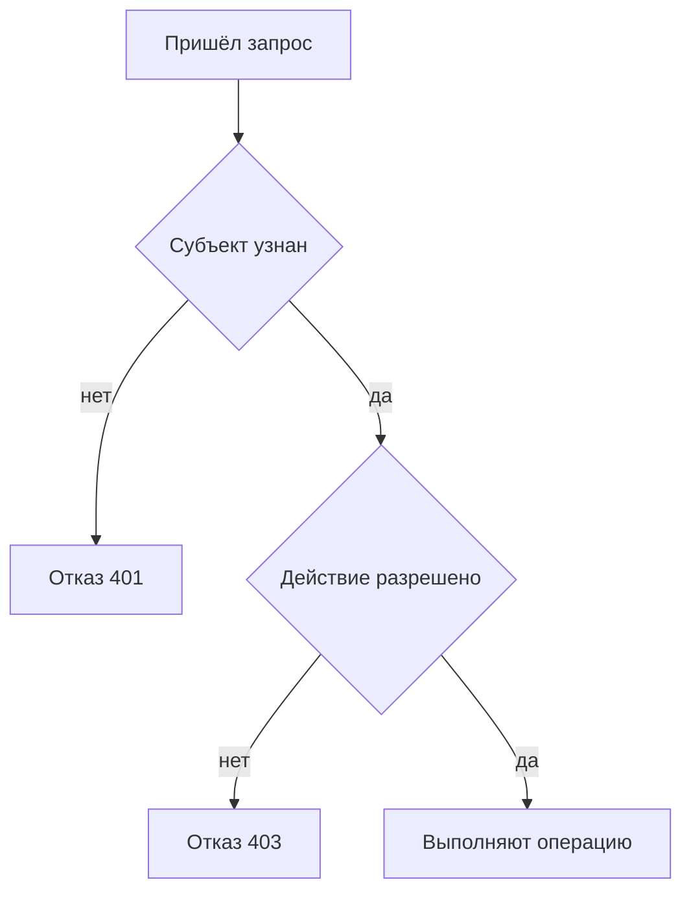

# Аутентификация и авторизация: в чём разница

↑ [[AN 1.3 Аутентификация и безопасность API|1.3 Аутентификация и безопасность API]] · → [[AN 1.3.2 API-ключ, Basic, Bearer|Следующая]]

<!-- meta:start -->
<div class="meta-strip"><span class="badge must">Обязательно</span><span class="chip">~5 мин чтения</span><span class="chip">Уровень: junior</span></div>
<!-- meta:end -->

> [!info] Зачем это аналитику и PM
> В баге «нет доступа» смешивают две разные поломки: система не узнала человека и система узнала, но запретила действие. Пока это не различено, чинят токен вместо роли или наоборот.

## План темы
- [x] кто вы и что вам можно
- [x] роли и права
- [x] 401 и 403

## Объяснение

Аутентификация отвечает на вопрос «кто это». Авторизация отвечает на вопрос «что этому субъекту можно». Оба шага нужны почти каждому API, но ломаются по-разному и чинятся разными людьми.

Как проходная и кабинет. На проходной сверяют пропуск: это аутентификация. В кабинете бухгалтерии пропуск уже принят, но чужие ведомости всё равно не выдают: это авторизация. Пропуск не заменяет допуск к шкафу.

### Кто вы

Субъект — человек, сервис или ключ интеграции. Система сопоставляет предъявленное (пароль, ключ, токен) с учётной записью. Если предъявить нечего или срок истёк, разговор заканчивается до проверки прав. В требованиях этот шаг называют отдельно: «гость не вошёл» и «сотрудник вошёл» — разные экраны.

### Что можно

После узнавания смотрят правила. Роль — именованный набор, например «аналитик» или «администратор заказов». Право — одно действие: прочитать заказ, отменить, выгрузить. У двух людей с одной ролью права обычно совпадают, но конкретный заказ может быть запрещён и роли: это уже правило на ресурс, «только свои клиенты». Как у вас устроены роли, не выдумывают по названию кнопки. Список берёт владелец сервиса.



### Коды 401 и 403

`401` значит: не доказали, кто вы, или сессия кончилась. Имеет смысл войти снова или обновить токен. `403` значит: вас узнали, операцию делать нельзя. Повторный вход ту же роль не расширит. Английское имя `401` Unauthorized легко прочитать как «нет прав». В баге пишут число. Часть API прячет чужой ресурс за `404`, чтобы не подтверждать, что он есть. Это политика, её надо знать до приёмки, а не считать дефектом справочника.

| Ситуация | Что проверяли | Типичный код |
|---|---|---|
| Нет токена или он просрочен | Аутентификация | 401 |
| Токен живой, роль не та | Авторизация | 403 |
| Чужой объект скрыт | Политика команды | 403 или 404 |
| Вошли и действие разрешено | Оба шага | 2xx |

## Примеры

Схема двух отказов на учебном хосте. Это не ответ вашего сервера.

```http
GET /orders/1042 HTTP/1.1
Host: api.example.com
```

Без заголовка допуска ожидайте отказ «не узнали», часто `401`. Тот же путь с маской `Authorization: Bearer eyJ...` и ролью без права на чужой заказ — уже спор про авторизацию, часто `403`. 
## Нюансы и подводные камни

- Одна роль на макете не равна матрице прав. В задаче лучше таблица «роль и действие», чем слово «доступ есть».
- Сервис, который ходит в API сам, тоже субъект. У него свои права, не права человека, который нажал кнопку.
- Успешный вход не значит, что все методы открыты. Список заказов и выгрузка персональных данных часто разведены.
- `401` на одном стенде и `200` на другом при том же пользователе — сначала сравните, куда выдан токен.

## Практика

Для действий «смотреть свой заказ» и «отменять чужой» напишите, какой отказ получит гость без входа и какой — вошедший аналитик без права отмены.

**Ожидаемый результат:** у гостя отказ на шаге «кто вы», у аналитика на чужой отмене отказ на шаге «что можно». Коды либо взяты из контракта вашей команды, либо помечены вопросом, а не угаданы.

## Вопросы с ответами

> [!question]- Чем аутентификация отличается от авторизации?
> Первая узнаёт субъект. Вторая решает, можно ли ему это действие над этим ресурсом. Пропуск на проходной не открывает каждый шкаф.

> [!question]- Почему повторный логин не лечит 403?
> Система уже знает, кто вы. Не хватает права или совпадения правила «только свои». Нужна другая роль или другое правило, а не новый пароль.

> [!question]- Роль и право — одно и то же?
> Нет. Роль группирует права под именем. Право — конкретное действие. Две роли могут делить часть прав и расходиться в одной опасной операции.

> [!question]- Всегда ли чужой ресурс отвечает 403?
> Нет. Иногда отвечают `404`, чтобы не сообщать, что запись существует. Какой код ваш, написано у команды, это не универсальная константа.

## Связано с блоком Developer

- [[BE 3.4.1 Аутентификация и авторизация в ASP.NET Core — схемы, handlers|3.4.1 Аутентификация и авторизация в ASP.NET Core — схемы, handlers]]
- [[BE 3.4.4 Политики, роли, claims-based и resource-based авторизация|3.4.4 Политики, роли, claims-based и resource-based авторизация]]

## Связанные темы

- [[AN 1.3.2 API-ключ, Basic, Bearer|Ключ, Basic и Bearer]]
- [[AN 1.2.4 Коды ответов — 2xx, 3xx, 4xx, 5xx|Коды ответов]]
- [[AN 1.3.5 Безопасность для аналитика — что нельзя светить|Что нельзя светить]]
