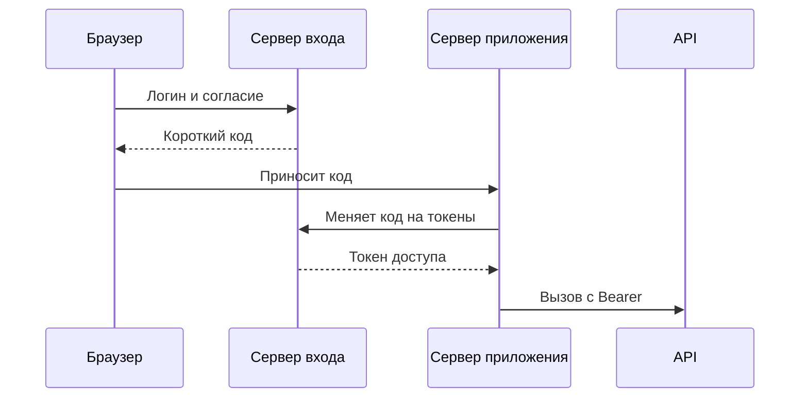

# OAuth 2.0 и OpenID Connect на пальцах

↑ [[AN 1.3 Аутентификация и безопасность API|1.3 Аутентификация и безопасность API]] · ← [[AN 1.3.2 API-ключ, Basic, Bearer|Предыдущая]] · → [[AN 1.3.4 JWT — как прочитать токен|Следующая]]

<!-- meta:start -->
<div class="meta-strip"><span class="badge must">Обязательно</span><span class="chip">~6 мин чтения</span><span class="chip">Уровень: junior</span></div>
<!-- meta:end -->

> [!info] Зачем это аналитику и PM
> Фраза «войти через корппортал» почти всегда означает чужой сервер входа, набор разрешений и два разных токена. Если в требованиях этого нет, экран обещает вход, а API не знает, чей это доступ.

## План темы
- [x] роли
- [x] потоки (code, client credentials)
- [x] scopes
- [x] refresh-токен
- [x] SSO

## Объяснение

OAuth 2.0 — рамка, по которой приложение получает ограниченный доступ к API, не забирая пароль пользователя себе навсегда. OpenID Connect — надстройка над этой рамкой про личность: кто вошёл. Пароль при этом остаётся у сервера входа, а не в вашем сервисе.

Как доверенность. Человек не отдаёт печать. Он в окне нотариуса говорит, что курьер может забрать только одну папку. Курьер уносит доверенность, не печать. Нотариус здесь — сервер входа. Курьер — ваше приложение. Папка — API.

### Кто участвует

Пользователь владеет доступом. Клиент — приложение, которое просит доступ: сайт, мобильное приложение или ваш сервер. Сервер авторизации выпускает токены. Сервер ресурса — само API, которое принимает токен. В жизни сервер входа и API может поставлять одна компания, роли всё равно полезно называть раздельно. 
### Два частых потока

Код авторизации (authorization code) нужен, когда в цепочке есть человек. Его отправляют на страницу входа, после согласия браузер возвращается в приложение с коротким кодом. Уже сервер приложения меняет код на токены. Если у клиента нет своего секрета, провайдер часто требует PKCE. Как именно, смотрите в его документации.
Клиентские учётные данные (client credentials) — вход без человека. Сервис подтверждает себя своим идентификатором и секретом и получает токен на себя. Так ходят фоновые интеграции. Этот токен нельзя описывать в сценарии как «действие Ивана»: Ивана в потоке нет.



Схема — каркас потока с кодом для приложения с серверной частью. Шаги браузерного приложения без сервера отличаются. Не переносите схему в постановку один в один, пока её не сверили с провайдером.

### Scopes, refresh и SSO

Scope — строка разрешения: что токену можно. Их список согласуют заранее. Лишний scope в задаче расширяет доступ без нужды. Токен доступа живёт недолго. Refresh-токен, если его вообще выдают, нужен чтобы получить новый доступ без нового логина. Не каждый провайдер и не каждый поток выдаёт refresh. Это проверяют в документации, не предполагают.

OpenID Connect добавляет id token: утверждение, кто вошёл. Его не путают с access token, которым зовут API. SSO (single sign-on, один вход) — когда несколько приложений узнают человека через тот же сервер входа. Отдельный пароль в каждом продукте тогда не заводят. 
## Примеры

Схема вызова после того, как токен уже получен. Секрет клиента в этот запрос не кладут.

```http
GET /orders HTTP/1.1
Host: api.example.com
Authorization: Bearer eyJ...
```

Фрагмент требований, который можно положить в задачу. Значения scope вымышлены.

```text
поток: authorization code, есть человек
клиент: веб-приложение с серверной частью
scopes: orders.read
токен к API: access token
личность на экране: id token, если провайдер его выдаёт
refresh: только если есть в документации провайдера
```

## Нюансы и подводные камни

- Пароль пользователя не сохраняют в вашем API «для надёжности». В OAuth его место на сервере входа.
- Access token и id token решают разные задачи. Подпись «войти» на экране не доказывает, что токен годится для чужого метода.
- - Секрет клиента — такой же секрет, как ключ API. Его нет в мобильной сборке и в публичном репозитории.

## Практика

Для входа сотрудника в кабинет и для ночной выгрузки в соседнюю систему выберите поток, субъекта и один scope. Адреса конечных точек оставьте пустыми, если их нет в документации.

**Ожидаемый результат:** у сотрудника указан поток с человеком и отдельно сказано, откуда берётся личность. У выгрузки указан поток без человека. Ни в одной строке нет пароля пользователя и нет выдуманного URL провайдера.

## Вопросы с ответами

> [!question]- OAuth забирает пароль в наше приложение?
> Нет. Пароль остаётся на сервере входа. Приложение получает токены с ограниченным смыслом. Хранить пароль «рядом на всякий случай» нельзя.

> [!question]- Чем код авторизации отличается от client credentials?
> В первом потоке есть человек и согласие. Во втором сервис подтверждает сам себя и действует от своего имени. Путать их значит приписать ночной выгрузке конкретного сотрудника.

> [!question]- Что такое scope?
> Именованное разрешение для токена, например чтение заказов. Состав scope согласуют с провайдером. Лишнее разрешение в задаче шире реального сценария.

## Связано с блоком Developer

- [[BE 3.4.3 OAuth 2.0, OpenID Connect и Keycloak на бэкенде|3.4.3 OAuth 2.0, OpenID Connect и Keycloak на бэкенде]]
- [[FE 5.5 Аутентификация и доступ — Keycloak, SSO, ACL|5.5 Аутентификация и доступ — Keycloak, SSO, ACL]]

## Связанные темы

- [[AN 1.3.2 API-ключ, Basic, Bearer|Bearer-токен]]
- [[AN 1.3.4 JWT — как прочитать токен|Как прочитать JWT]]
- [[AN 1.3.1 Аутентификация и авторизация — в чём разница|Кто вы и что можно]]
