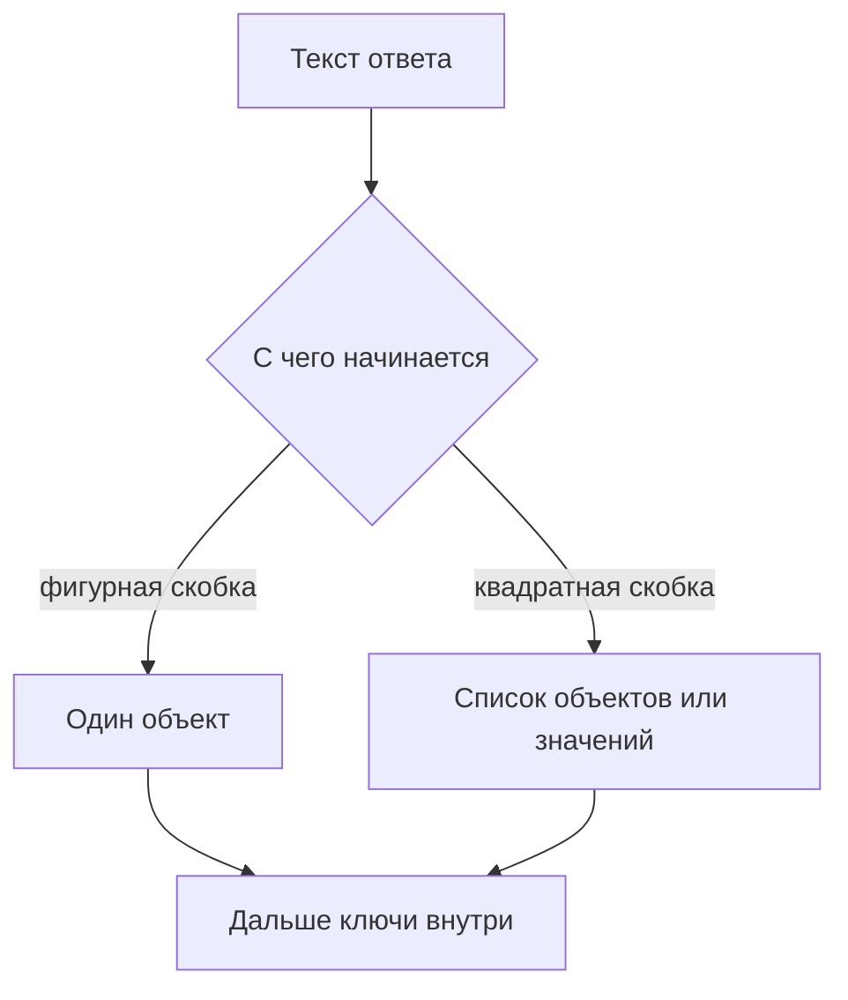

# Как читать JSON: объекты, массивы, значения

↑ [[AN 1.4 JSON, XML и другие форматы|1.4 JSON, XML и другие форматы]] · → [[AN 1.4.2 Типы данных, null, даты и числа|Следующая]]

<!-- meta:start -->
<div class="meta-strip"><span class="badge must">Обязательно</span><span class="chip">~6 мин чтения</span><span class="chip">Уровень: junior</span></div>
<!-- meta:end -->

> [!info] Зачем это аналитику и PM
> Ответ API и пример в задаче почти всегда приходят текстом JSON. Если не отличить объект от списка, в требования уедет «поле заказа», которого нет: есть список заказов, а поле лежит у первого элемента.

## План темы
- [x] фигурные и квадратные скобки
- [x] ключи и значения
- [x] вложенность
- [x] как не потеряться в длинном ответе

## Объяснение

JSON (JavaScript Object Notation) — текстовая запись данных: объекты, списки и отдельные значения. Пробелы и переносы строк на смысл не влияют. Запятая в конце элемента запрещена, из-за неё весь текст перестаёт быть JSON.

Как анкета и стопка одинаковых карточек. Анкета — объект: у каждого поля подпись. Стопка — массив: карточки идут по порядку, подписи у стопки нет, подписи внутри каждой карточки. Длинный ответ — папка, где анкета лежит в стопке, а в анкете ещё одна стопка.

### Скобки, ключи, вложенность

Фигурные скобки `{ }` держат объект. Внутри пары «ключ: значение». Ключ — строка в двойных кавычках. Двоеточие разделяет ключ и значение, запятая разделяет пары. Квадратные скобки `[ ]` держат массив: значения подряд, без имён. Имя есть у поля объекта, не у места в массиве. Место задают номером с нуля: первый элемент — номер 0.

Значение само бывает объектом или массивом. Так получается вложенность: заказ содержит список позиций, позиция содержит артикул. Имена читают слева направо: «у заказа возьми позиции, у первой позиции возьми артикул». Путь по такой цепочке разобран в соседней теме. Пока важно не назвать массивом то, что является одним объектом, и не искать ключ `0` там, где нужен первый элемент списка.



### Длинный ответ

Не читают файл с первой строки до последней. Сначала формулируют вопрос: нужен один заказ или страница списка, нужен статус или сумма. В списке раскрывают один элемент и сверяют имена полей с ним. Остальные элементы устроены так же, если контракт это обещает. Служебные поля страницы (`limit`, ярлык продолжения) лежат рядом со списком, а не внутри каждого заказа. Их не описывают как поля товара.

## Примеры

Учебный объект JSONPlaceholder. Текст ниже совпадает с обычным телом `GET /todos/1`.

```json
{
  "userId": 1,
  "id": 1,
  "title": "delectus aut autem",
  "completed": false
}
```

Это один объект, четыре ключа. `completed` — логическое значение, не строка. Список из двух таких дел выглядел бы как массив объектов. Схема, не снимок сервиса:

```json
[
  {"id": 1, "title": "первая"},
  {"id": 2, "title": "вторая"}
]
```

Заказ с вложением, тоже схема:

```json
{
  "id": "1042",
  "items": [
    {"sku": "MUG-1", "qty": 2}
  ]
}
```

Артикул здесь не поле заказа. Он поле первого элемента `items`.

## Нюансы и подводные камни

- Одинарные кавычки и комментарии в тексте JSON недопустимы. То, что открылось в редакторе, ещё не обязано разобраться.
- Два ключа с одним именем в объекте — ошибка договорённости. Чем кончится разбор, зависит от инструмента. В контракте имена не повторяют.
- Пустой объект `{}` и пустой массив `[]` — разные ответы. «Нет заказов» обычно пустой список, а не пустая анкета.
- Порядок ключей в объекте не считается значимым. Порядок элементов массива значим.
## Практика

Возьмите один JSON: ответ стенда или учебный объект выше. Подпишите, где объект, где массив, и выпишите три ключа своими словами.

**Ожидаемый результат:** у списка сказано «это массив», у карточки «это объект». Для вложенного поля указан путь из имён, а не только короткое имя вроде `title`, если такое имя встречается в двух уровнях.

## Вопросы с ответами

> [!question]- Чем объект отличается от массива?
> У объекта у каждого значения есть ключ в кавычках. У массива значения стоят по порядку и снаружи безымянны. Скобки разные: фигурные и квадратные.
> [!question]- С какого номера начинается массив?
> С нуля. Первый элемент — индекс 0. В разговоре «первая позиция» и в тексте `[0]` — одно и то же место.
> [!question]- Почему длинный ответ не читают сверху вниз?
> Вопрос к данным уже известен: статус, сумма, страница. Ищут ключ этого вопроса, один элемент списка и служебные поля рядом со списком. Остальное сверяют выборочно.

## Связано с блоком Developer

- [[BE 3.3.5 DTO, маппинг и контракты API|3.3.5 DTO, маппинг и контракты API]]
- [[BE 2.1.11 Сериализация — System.Text.Json и Newtonsoft|Сериализация JSON]]

## Связанные темы

- [[AN 1.2.6 Тело запроса — JSON, form-data, urlencoded, файлы|Тело запроса]]
- [[AN 1.4.2 Типы данных, null, даты и числа|Типы, null, даты]]
- [[AN 1.4.3 Вложенность и массивы — путь к значению, JSONPath|Путь к значению]]
