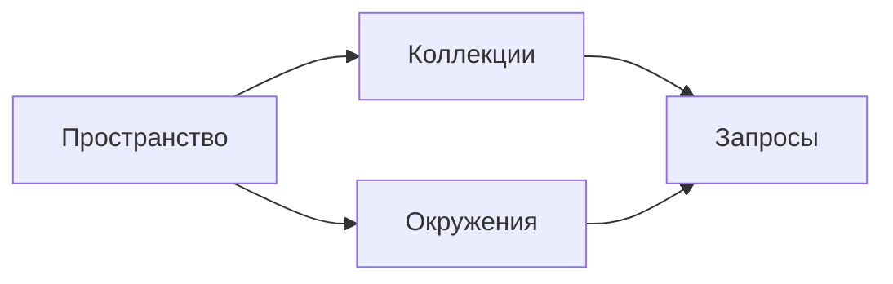

# Установка и интерфейс Postman

↑ [[AN 1.5 Postman — от установки до коллекций|1.5 Postman: от установки до коллекций]] · → [[AN 1.5.2 Первый запрос — GET и POST|Следующая]]

<!-- meta:start -->
<div class="meta-strip"><span class="badge must">Обязательно</span><span class="chip">~4 мин чтения</span><span class="chip">Уровень: junior</span></div>
<!-- meta:end -->

> [!info] Зачем это аналитику и PM
> Пока неясно, где коллекция, где окружение и где история, команда правит разные копии одного вызова. Postman здесь только верстак: он не заменяет стенд и документацию.

## План темы
- [x] рабочие пространства
- [x] вкладки
- [x] коллекции, окружения, история
- [x] вход и синхронизация

## Объяснение

Postman — клиент, из которого отправляют HTTP-запрос и сохраняют его. Сервером вашего API он не является.

Как лаборатория. Коллекция — папка опытов. Окружение — табличка, какой стенд сегодня выбран. История — черновики, которые ещё не убрали в папку. Рабочее пространство — комната команды: чужая комната вам не видна.

### Экран запроса

Вкладка запроса содержит метод, адрес и отправку. Кнопку отправки долго называли Send. Если подпись другая, ориентируйтесь на действие «отправить». Ниже или рядом устойчивые зоны: Params для query, Authorization для допуска, Headers для служебных строк, Body для тела. Скрипты до и после запроса лежат там же. Имена зон сверьте со своей версией один раз.

Коллекции и окружения ищут списком сбоку. История помнит отправленное, но не является договором. В задачу кладут сохранённый запрос.

### Вход

Синхронизация между людьми обычно требует учётную запись Postman. Можно ли открыть программу без входа, проверьте при установке: это менялось. Клиент берите с официального сайта или их веб-версию, не из случайной ссылки. Какие пределы у бесплатного режима, смотрите на сайте Postman в день установки. В эту заметку цены не копируют.



## Примеры

Учебный вызов, чтобы найти код ответа на экране:

```bash
curl -sS "https://jsonplaceholder.typicode.com/todos/1"
```

В клиенте тот же адрес и метод GET. После отправки нужны код, тело и время. Куда программа пишет миллисекунды, посмотрите сами: место подписи менялось.

## Нюансы и подводные камни

- История пропадает как общий документ. Коллеге отдают коллекцию.
- Два пространства с одним именем коллекции — два разных набора.
- Вход в Postman не открывает ваш API. Допуск к стенду получают отдельно.
- Веб-клиент и установленное приложение могут разойтись в кнопках. В инструкции пишите действие, не только пункт меню.

## Практика

Найдите список коллекций, список окружений и поле адреса. Отправьте учебный GET и прочитайте код.

**Ожидаемый результат:** понятно, куда сохранится запрос и где виден код. Подписи, которые отличаются от Send, Params и Body, записаны так, как на вашем экране.

## Вопросы с ответами

> [!question]- Postman заменяет документацию API?
> Нет. Он помогает отправить запрос и сохранить пример. Смысл полей и кодов берётся из описания сервиса.

> [!question]- Нужна ли учётная запись?
> Для общей коллекции команды обычно да. Локальный режим проверьте в своей сборке. Тарифы смотрите на сайте Postman, здесь их нет.

> [!question]- Что такое рабочее пространство?
> Общая полка коллекций и окружений. Человек вне пространства эту полку не видит, даже если метод API тот же.

> [!question]- Почему в шагах нет полного меню?
> Пункты меню переезжали. Надёжен смысл действия. Точное имя кнопки один раз сверяют и дописывают в шпаргалку команды.

## Связано с блоком Developer

- [[DO 1.8 Утилиты — grep, sed, awk, find, curl, jq, htop, ss, lsof|Утилиты командной строки, curl]]

## Связанные темы

- [[AN 1.5.2 Первый запрос — GET и POST|Первый запрос]]
- [[AN 1.7.5 curl и командная строка — минимум|curl без клиента]]
- [[AN 1.1.6 Как найти API — документация, Swagger UI, DevTools, коллекции|Где искать API]]
