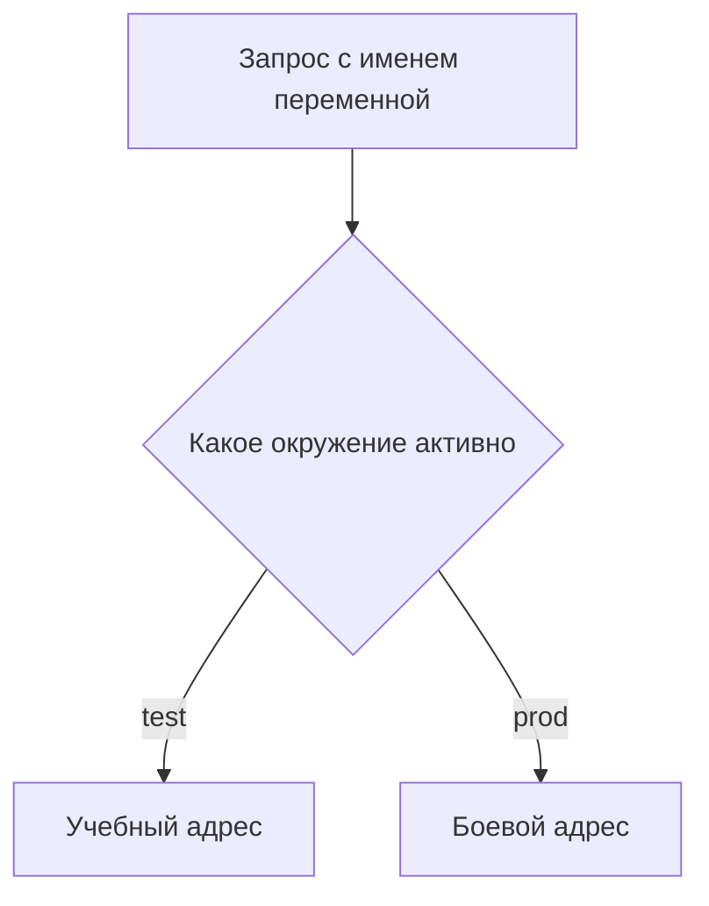

# Переменные и окружения (environments)

↑ [[AN 1.5 Postman — от установки до коллекций|1.5 Postman: от установки до коллекций]] · ← [[AN 1.5.2 Первый запрос — GET и POST|Предыдущая]] · → [[AN 1.5.4 Коллекции — папки, порядок, документирование|Следующая]]

<!-- meta:start -->
<div class="meta-strip"><span class="badge must">Обязательно</span><span class="chip">~4 мин чтения</span><span class="chip">Уровень: junior</span></div>
<!-- meta:end -->

> [!info] Зачем это аналитику и PM
> Сценарий один, стенды разные. Если адрес зашит в запрос, копия для теста легко уходит на бой. Переменная и отдельное окружение оставляют сценарий тем же, а хост подменяют выбором.

## План темы
- [x] подстановка адреса через переменную
- [x] глобальные, окружения, коллекции
- [x] секретные значения
- [x] переключение dev/test/prod

## Объяснение

Переменная — имя, вместо которого клиент подставляет значение перед отправкой. Окружение — набор значений одного стенда.

Как табличка на двери. На двери написано имя. Табличка test подставляет учебный хост, табличка prod — боевой. Дверь не переписывают. Если табличка не выбрана, уйдёт сырое имя и сервер не найдётся.

### Области

Адрес стенда и допуск держите в окружении: они меняются вместе со стендом. То, что одинаково для всех стендов и принадлежит сценарию, может жить на коллекции. Более общие значения на всё пространство тоже бывают. Кто кого перекрывает, сверьте в справке вашей версии: список областей расширяли. Не запоминайте чужую шпаргалку десятилетней давности как закон.

Секрет не кладут в файл для чата и git. Если клиент умеет помечать значение секретным или хранить текущее отдельно от начального, используйте это и проверьте экспорт. Имя галочки запишите у себя. В примерах только маска.



## Примеры

Строка адреса в запросе:

```text
{{baseUrl}}/todos/1
```

Упрощённая схема окружения, не полный файл экспорта. У настоящей выгрузки больше служебных полей.

```json
{
  "name": "test",
  "values": [
    {"key": "baseUrl", "value": "https://jsonplaceholder.typicode.com", "enabled": true}
  ]
}
```

Второе окружение с `https://api.example.com` переключает хост, не трогая коллекцию. Токен в схему не входит.

## Нюансы и подводные камни

- Без активного окружения подстановка не случается. Это не поломка API.
- Одно имя в коллекции и в окружении легко прочитать не оттуда. Адрес задавайте в одном месте.
- Экспорт может унести секрет. Откройте файл до отправки.
- Имена стендов в команде могут быть не dev и не prod. Подписывайте окружение их словами.

## Практика

Два окружения, одна переменная адреса, один GET. Переключите окружение, не правя строку запроса.

**Ожидаемый результат:** в адресе запроса нет хоста буквами. Фактический хост меняется вместе с именем окружения. В файле для коллеги нет токена.

## Вопросы с ответами

> [!question]- Зачем не вписать адрес руками?
> Ручной адрес приклеен к стенду. Переменная оставляет запрос общим, стенд выбирают отдельно. Так реже бьют в бой.

> [!question]- Чем окружение отличается от коллекции?
> Коллекция — запросы. Окружение — значения стенда. Одна коллекция обслуживает несколько окружений.

> [!question]- Куда класть токен?
> В секрет окружения, если версия это умеет, и не в экспорт для чата. В тексте примера — маска. Утёкший токен гасят.

> [!question]- Запрос ушёл не туда.
> Было активно другое окружение, либо хост до сих пор вписан мимо переменной. Перед отправкой читают имя окружения и собранный адрес.

## Связано с блоком Developer

- [[DO 3.8 Секреты и окружения — dev, staging, prod|3.8 Секреты и окружения — dev, staging, prod]]

## Связанные темы

- [[AN 1.1.4 Окружения и стенды — dev, test, stage, prod|Стенды]]
- [[AN 1.3.5 Безопасность для аналитика — что нельзя светить|Что нельзя светить]]
- [[AN 1.5.5 Авторизация в Postman|Допуск в клиенте]]
