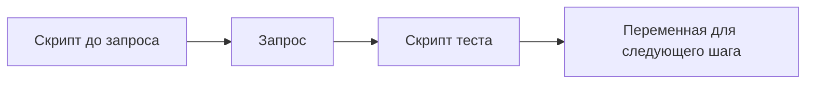

# Pre-request скрипты и тесты

↑ [[AN 1.5 Postman — от установки до коллекций|1.5 Postman: от установки до коллекций]] · ← [[AN 1.5.5 Авторизация в Postman|Предыдущая]] · → [[AN 1.5.7 Collection Runner, Newman и запуск в CI|Следующая]]

<!-- meta:start -->
<div class="meta-strip"><span class="badge must">Обязательно</span><span class="chip">~5 мин чтения</span><span class="chip">Уровень: junior</span></div>
<!-- meta:end -->

> [!info] Зачем это аналитику и PM
> Ручная проверка «глянул и вроде 200» не переживает второй прогон. Короткий тест фиксирует, какой код и какое поле вы считаете успехом, а скрипт до запроса готовит дату или идентификатор, не заставляя печатать их каждый раз.

## План темы
- [x] pm.test, pm.expect, проверка статуса и полей
- [x] сохранение значений между запросами
- [x] динамические данные (uuid, дата)

## Объяснение

У запроса два скрипта. Pre-request выполняется до отправки. Tests выполняется после ответа. Это обычный JavaScript в песочнице клиента, не код вашего сервера.

Как контролёр на приёмке. До отправки он ставит дату на бланк. После ответа сверяет штамп и номер. Если штампа нет, пачка не считается принятой, даже если бумага пришла.

### Проверки

`pm.test` даёт проверке имя, которое вы увидите в итоге прогона. `pm.expect` сравнивает факт с ожиданием. Для кода берут `pm.response.code`. Для JSON — `pm.response.json()`, и дальше имя поля. Падение теста не чинит сервер: оно говорит, что договор в этом шаге не сошёлся.

Не проверяйте весь ответ строка в строку, если договор про одно поле. Лишний ключ в учебном сервере тогда будет выглядеть как поломка продукта.

### Данные между шагами

Ответ первого запроса часто нужен второму: номер созданной записи. Скрипт теста записывает его в переменную окружения. Следующий запрос подставляет имя переменной в путь. Это работает в прогоне по порядку. Одинокая вкладка без предыдущего шага переменной не получит.

Дату в скрипте берут из `new Date()`. Идентификатор можно собрать там же или подставить динамической переменной клиента. Каталог таких подстановок менялся. Имена вроде guid и timestamp сверьте в справке вашей версии, в заметке это не закон.



## Примеры

Проверка кода и поля. Учебный адрес JSONPlaceholder, не ваш контракт.

```javascript
pm.test("код 200", function () {
  pm.expect(pm.response.code).to.eql(200);
});

const body = pm.response.json();
pm.test("есть id", function () {
  pm.expect(body).to.have.property("id");
});
```

Дата для следующего шага и запоминание номера:

```javascript
const stamp = new Date().toISOString();
pm.environment.set("sentAt", stamp);

const created = pm.response.json();
pm.environment.set("todoId", String(created.id));
```

Второй фрагмент имеет смысл в тесте, когда ответ уже есть. Дату можно поставить и в pre-request, до отправки. Не печатайте в консоль токен.

## Нюансы и подводные камни

- Тест на код `200` молчит про чужое тело. Добавьте поле, без которого сценарий бессмыслен.
- `pm.response.json()` падает, если пришёл HTML или пусто. Сначала смотрите код и тип.
- Запись в окружение меняет текущие значения на вашем клиенте. Чужой прогон их не видит.
- Скрипт с секретом в открытую нельзя класть в общий экспорт.

## Практика

На учебном GET добавьте тест кода и тест одного поля. На POST, если сохраняете ответ, запишите `id` в переменную и вторым запросом прочитайте этот номер.

**Ожидаемый результат:** при верном ответе обе проверки зелёные. Если подменить ожидаемый код на заведомо чужой, проверка краснеет. В скрипте нет живого допуска.

## Вопросы с ответами

> [!question]- Чем pre-request отличается от Tests?
> Pre-request идёт до отправки: дата, идентификатор, подготовка переменной. Tests идёт после ответа: код, поля, запись значения для следующего запроса.

> [!question]- Зачем имя в pm.test?
> Прогон показывает это имя у красной строки. «код 200» понятнее, чем безымянное падение на десятом шаге.

> [!question]- Как передать номер из создания в чтение?
> Тест создания пишет номер в переменную окружения. Следующий запрос подставляет её в путь. Без прогона по порядку переменная может быть пустой.

> [!question]- Можно ли скопировать скрипт токена из интернета?
> Нет. Адреса выдачи и имена полей берёт команда вашего контура. Чужой скрипт легко шлёт секрет не туда.

## Связано с блоком Developer

- [[BE 2.4.1 Виды тестов и пирамида в .NET|Виды тестов]]

## Связанные темы

- [[AN 1.2.4 Коды ответов — 2xx, 3xx, 4xx, 5xx|Коды ответов]]
- [[AN 1.5.3 Переменные и окружения (environments)|Куда писать значение]]
- [[AN 1.5.7 Collection Runner, Newman и запуск в CI|Где эти тесты гоняют пачкой]]
