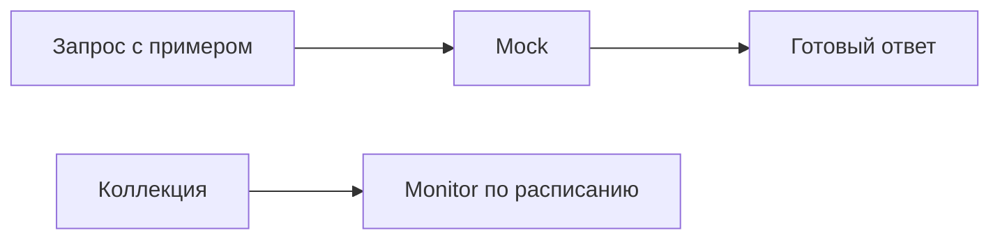

# Mock-серверы, Monitors и альтернативы

↑ [[AN 1.5 Postman — от установки до коллекций|1.5 Postman: от установки до коллекций]] · ← [[AN 1.5.8 Импорт и экспорт — cURL, OpenAPI, Swagger|Предыдущая]]

<!-- meta:start -->
<div class="meta-strip"><span class="badge must">Обязательно</span><span class="chip">~4 мин чтения</span><span class="chip">Уровень: junior</span></div>
<!-- meta:end -->

> [!info] Зачем это аналитику и PM
> Пока настоящего метода нет, интерфейсу нужен хоть какой-то ответ. Mock отдаёт сохранённый пример. Monitor по расписанию проверяет уже живой сценарий. Другие клиенты делают то же руками, если Postman команде не подходит.

## План темы
- [x] mock по примерам ответов
- [x] мониторинг доступности
- [x] Insomnia, Bruno, Hoppscotch, HTTPie, curl

## Объяснение

Mock-сервер Postman отвечает тем примером, который вы сохранили у запроса. Он не считает склад и не ходит в вашу базу. Это заглушка формы, чтобы экран или соседняя команда не ждали готовности метода.

Как манекен в витрине. Покрой виден, человека внутри нет. Адрес заглушки показывает сам Postman после создания. Шаблон этого адреса здесь не выдумывается: скопируйте его с экрана.

### Monitor

Monitor гоняет коллекцию по расписанию в облаке Postman и сообщает, что прогон разошёлся. Это не замена журналов вашего сервера и не договор о простое. Лимиты, цену и куда приходит сигнал смотрите на сайте Postman в день настройки. В заметку цифры не копируют.

Перед включением выберите учебное окружение. Боевой прогон каждые несколько минут создаёт настоящие заказы, если сценарий их создаёт.

### Другие клиенты

Имена, которые встречаются рядом: Insomnia, Bruno, Hoppscotch, HTTPie и curl. Первые три — клиенты с окном или страницей. HTTPie и curl — команды в терминале. Лицензии, тарифы и то, какой продукт сейчас активнее, здесь не утверждаются: это меняется, смотрите сайт каждого. Для аналитика важно другое. Коллекция или спецификация переносится, а смысл метода от клиента не зависит. Если коллега не в Postman, отдайте cURL или OpenAPI, не скрин вкладки.



## Примеры

Пример, который mock может отдать как есть. Это учебная форма, не ответ вашего стенда.

```json
{"id": 1, "title": "example", "completed": false}
```

Тот же адрес без клиента:

```bash
curl -sS "https://jsonplaceholder.typicode.com/todos/1"
```

JSONPlaceholder здесь живой учебный сервис, не mock Postman. Свой mock проверяют адресом, который показала программа.

## Нюансы и подводные камни

- Заглушка не ловит ошибку расчёта. Она повторяет текст примера, пока вы его не смените.
- Пример с боевыми полями клиента станет публичным, если адрес mock раздали широко. Оставляйте выдуманные значения.
- Monitor на создании данных засоряет стенд. Для расписания берите чтение.
- Спор «какой клиент правильный» не заменяет контракт. В задаче фиксируют метод, путь и код.

## Практика

Сохраните у учебного GET один пример ответа и найдите, где клиент показывает адрес mock, если эта возможность в вашей сборке включена. Рядом откройте тот же учебный URL через curl.

**Ожидаемый результат:** понятно, что mock отдаёт сохранённый текст, а не считает данные. Адрес скопирован с экрана, не придуман. Для Insomnia, Bruno, Hoppscotch и HTTPie в конспекте нет утверждений про цену и лицензию.

## Вопросы с ответами

> [!question]- Mock заменяет стенд?
> Нет. Он отдаёт пример, чтобы согласовать форму ответа. Правила склада проверяют на стенде, когда метод уже есть.

> [!question]- Что делает Monitor?
> По расписанию гоняет коллекцию в облаке Postman и показывает, что прогон разошёлся. Лимиты и цену берите с сайта, не из этой заметки.

> [!question]- Обязателен ли Postman?
> Нет. Insomnia, Bruno, Hoppscotch, HTTPie и curl закрывают отправку запроса по-своему. Их статус и лицензии сверяйте у них. Общий язык команды — спецификация и пример cURL.

> [!question]- Почему не вписать адрес mock по памяти?
> Его выдаёт программа. Чужой шаблон из статьи может указывать не в вашу заглушку.

## Связано с блоком Developer

- [[BE 5.7.1 Моки внешних HTTP-сервисов — WireMock.Net, HttpMessageHandler|5.7.1 Моки внешних HTTP-сервисов — WireMock.Net, HttpMessageHandler]]

## Связанные темы

- [[AN 1.7.5 curl и командная строка — минимум|Тот же вызов без клиента]]
- [[AN 1.6.1 Как читать документацию API|Откуда брать форму ответа]]
- [[AN 1.5.8 Импорт и экспорт — cURL, OpenAPI, Swagger|Чем поделиться без Postman]]
