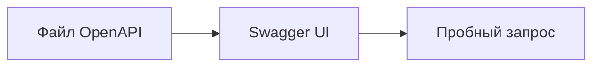

# OpenAPI и Swagger UI: структура спецификации

↑ [[AN 1.6 Документация API — Swagger и OpenAPI|1.6 Документация API: Swagger и OpenAPI]] · ← [[AN 1.6.1 Как читать документацию API|Предыдущая]] · → [[AN 1.6.3 Swagger Editor и описание метода|Следующая]]

<!-- meta:start -->
<div class="meta-strip"><span class="badge must">Обязательно</span><span class="chip">~6 мин чтения</span><span class="chip">Уровень: junior</span></div>
<!-- meta:end -->

> [!info] Зачем это аналитику и PM
> Страница с кнопками — это вид. Договор лежит в файле OpenAPI. Если знать, где путь, где схема и где ответ, спор «поле было в примере» решается ссылкой на кусок файла, а не скрином.

## План темы
- [x] paths, components, schemas
- [x] параметры
- [x] ответы
- [x] как пощупать метод прямо в Swagger UI

## Объяснение

OpenAPI — текст, который описывает HTTP API. Swagger — прежнее имя линейки и имя интерфейса Swagger UI, который этот текст показывает. Файл можно хранить в репозитории. Страница из него собирается.

Как чертёж и витрина. Чертёж — `paths` и `components`. Витрина позволяет нажать метод и увидеть форму. Ломается чертёж — витрина врёт, даже если краска свежая.

### Куски файла

В `paths` лежат пути и методы. У метода есть параметры и ответы. Повторяемую форму тела выносят в `components`, обычно в `schemas`, и ссылаются на неё. Так одно и то же «заказ» не описывают в четырёх местах по-разному.

Параметр говорит, где значение: в пути, в query, в заголовке. Поле `required` у параметра пути в нормальной спецификации истинно: без куска пути адреса нет. Тело запроса — отдельно, в содержимом метода, не в списке query.

Ответ — код и схема тела. У успеха и отказа схемы разные. Описание словами без кода не даёт клиенту ветку.

Пробный вызов в Swagger UI в классической сборке включали кнопкой Try it out. Подпись и место сверьте со своей версией. Вызов уходит на адрес из `servers`. Это не учебная песочница, если там указан боевой хост.

В OpenAPI 3.1 схема ближе к JSON Schema: пустое значение описывают типом null. В 3.0 для этого поле `nullable`. Пример ниже — версия 3.0.3, не смесь.



## Примеры

Короткий контракт чтения заказа. Ссылка на схему в кавычках: решётка в YAML иначе съедает хвост строки.

```yaml
openapi: "3.0.3"
info:
  title: Example Orders
  version: "1"
paths:
  /orders/{orderId}:
    get:
      summary: Прочитать заказ
      parameters:
        - name: orderId
          in: path
          required: true
          schema:
            type: string
      responses:
        "200":
          description: Заказ найден
          content:
            application/json:
              schema:
                $ref: "#/components/schemas/Order"
        "404":
          description: Нет такого заказа
components:
  schemas:
    Order:
      type: object
      required: [id]
      properties:
        id:
          type: string
        comment:
          type: string
          nullable: true
```

## Нюансы и подводные камни

- Имя Swagger на обложке не говорит версию файла. Смотрите `openapi`.
- Схема в `components`, на которую никто не ссылается, клиента не обязывает.
- Пробный вызов с настоящим ключом оставляет след на стенде. Для показа берите учебный адрес.
- Petstore — чужой учебный сервис. Его адрес копируют из документации Swagger, не из памяти.

## Практика

В любом файле OpenAPI 3.0.3 или 3.1.0 найдите один путь, один параметр и две схемы ответа: успех и отказ.

**Ожидаемый результат:** вы можете сказать, путь это или query, и где лежит форма тела. Версия файла названа строкой `openapi`, а не словом на кнопке.

## Вопросы с ответами

> [!question]- OpenAPI и Swagger UI — одно и то же?
> Нет. OpenAPI — файл договора. Swagger UI — страница, которая его показывает и иногда отправляет запрос.

> [!question]- Зачем components, если можно описать тело у метода?
> Повтор. Одна схема заказа, много методов. Правка в одном месте не разъезжается с соседним методом.

> [!question]- Куда делся параметр из пути?
> В список `parameters` с `in: path`. Он не появляется сам из фигурных скобок, пока его не описали.

> [!question]- Почему пробный вызов опасен?
> Он бьёт в адрес из `servers`. Если это не учебный стенд, вы создадите или прочитаете настоящие данные.

## Связано с блоком Developer

- [[BE 3.3.7 OpenAPI и Swagger, версионирование API|3.3.7 OpenAPI и Swagger, версионирование API]]

## Связанные темы

- [[AN 1.4.4 JSON Schema — описание структуры и валидация|Схема тела]]
- [[AN 1.5.8 Импорт и экспорт — cURL, OpenAPI, Swagger|Импорт файла в клиент]]
- [[AN 1.6.1 Как читать документацию API|Как читать страницу]]
