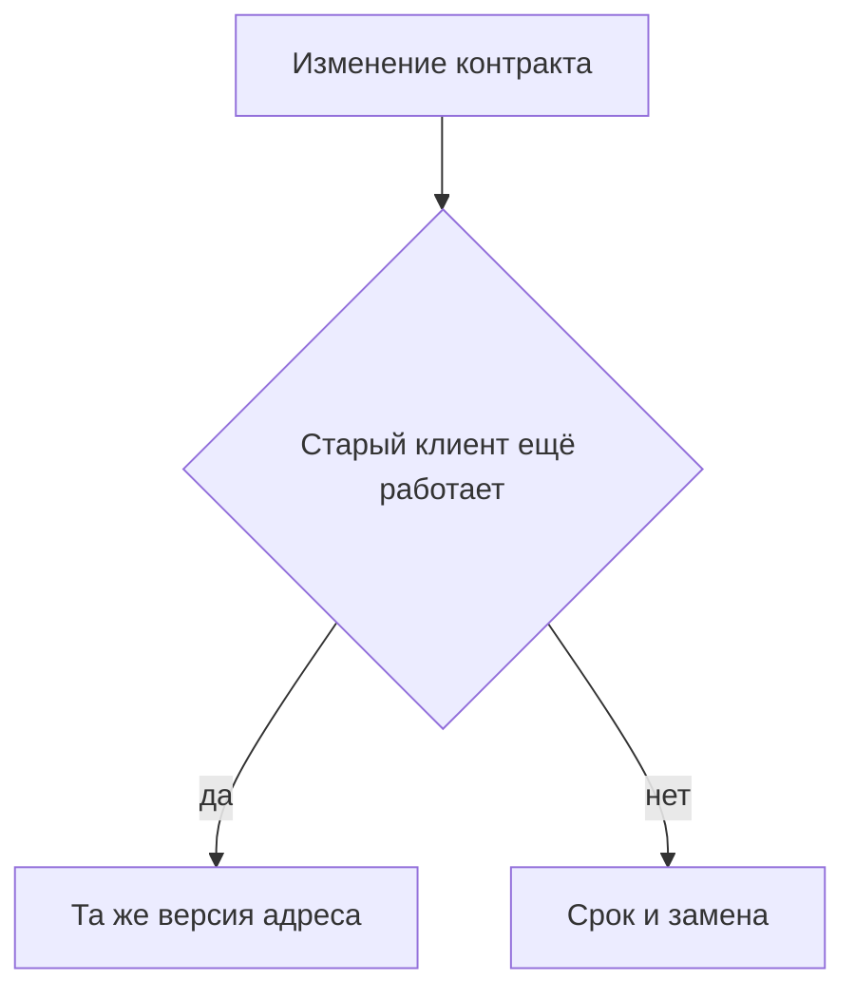

# Версионирование и изменения контрактов

↑ [[AN 1.6 Документация API — Swagger и OpenAPI|1.6 Документация API: Swagger и OpenAPI]] · ← [[AN 1.6.4 Redoc, порталы документации, Confluence|Предыдущая]]

<!-- meta:start -->
<div class="meta-strip"><span class="badge must">Обязательно</span><span class="chip">~5 мин чтения</span><span class="chip">Уровень: junior</span></div>
<!-- meta:end -->

> [!info] Зачем это аналитику и PM
> Поле, которое вчера было строкой, сегодня нельзя молча сделать числом. Клиенты уже выпустили свои программы. Изменение контракта либо совместимо со старым вызовом, либо это отдельное решение со сроком.

## План темы
- [x] breaking и non-breaking изменения
- [x] депрекейшн
- [x] как сообщать клиентам

## Объяснение

Контракт ломается, когда старый клиент, который ничего не менял, начинает получать отказ или другой смысл. Такое изменение называют ломающим. Совместимое добавление старый клиент может не заметить.

Как правило в подъезде. Новая строка «можно ещё так» никому не мешает. Строка «старый ключ больше не подходит» требует объявления и срока, иначе жильцы останутся у двери.

### Что ломает, а что нет

Обычно не ломает: новое необязательное поле, новый метод, новый код успеха, который старый клиент не обязан понимать, если он и раньше проверял только известные. Обычно ломает: удалили поле, переименовали, сменили тип, сделали необязательное обязательным, поменяли смысл того же значения, убрали метод.

Новое значение в перечислении — серая зона. Клиент, который отвергает незнакомые значения, сломается. Если такие клиенты есть, это ломающее изменение, даже если серверу «всего лишь добавили статус».

Номер в `info.version` — версия документа. Кусок `/v1` в адресе — версия, которую вызывает клиент. Это не одно и то же. Смена только номера в шапке не сохраняет старый адрес.

Устаревший метод помечают, а не стирают в тот же день. В OpenAPI 3.0 у операции есть признак `deprecated`. Рядом пишут, чем заменить и до какой даты старый путь ещё жив. Дату берёт команда, не эта заметка.

Клиентам говорят там, где их можно найти: описание к задаче, журнал изменений, письмо владельцам интеграций. Сообщение в закрытом чате аналитиков не считается доставкой. В тексте — что ломается, с какой версии, какой путь взамен.



## Примеры

Пометка устаревшего чтения. Файл версии 3.0.3. Дата в тексте условная, её подставляет команда.

```yaml
openapi: "3.0.3"
info:
  title: Example Orders
  version: "1.1.0"
paths:
  /orders/legacy/{orderId}:
    get:
      deprecated: true
      summary: Устаревшее чтение заказа
      description: Замена — GET /orders/{orderId}. Срок снимают отдельно, не этим примером.
      responses:
        "200":
          description: Заказ
```

| Изменение | Для старого клиента |
| --- | --- |
| Новое необязательное поле | обычно незаметно |
| Поле стало обязательным | ломает |
| Новое значение перечисления | может сломать строгого клиента |

## Нюансы и подводные камни

- «Мы добавили поле» ломает, если оно обязательное. Смотрят на `required`, не на глагол в чате.
- Две версии без владельца старой живут вечно и расходятся. У старой есть дата или явный наследник.
- Прятать ломку в том же пути хуже, чем новый путь. Клиент не узнает о смене типа, пока не упадёт.
- Журнал «исправили контракт» без списка полей нечего тестировать.

## Практика

Возьмите одно изменение: поле комментария было необязательным и стало обязательным. Напишите, ломающее ли оно, и одну фразу для клиентов.

**Ожидаемый результат:** изменение названо ломающим, потому что старый запрос без поля получит отказ. Во фразе есть суть и отсылка к задаче, без обещания выдуманной даты.

## Вопросы с ответами

> [!question]- Новое необязательное поле — это ломка?
> Обычно нет. Старый запрос его не шлёт и не обязан читать. Обязательным его делать уже нельзя без отдельного решения.

> [!question]- Хватает ли поднять info.version?
> Нет. Это номер документа. Клиент ходит по адресу. Если адрес и смысл те же, номер в шапке сам по себе никого не защищает и не предупреждает.

> [!question]- Как пометить устаревший метод?
> Признаком deprecated у операции и текстом, чем заменить. Срок снятия пишет команда в том канале, где клиенты это увидят.

> [!question]- Куда писать о ломке?
> В задачу, в журнал изменений и тем, кто уже интегрирован. Чат команды, где клиентов нет, доставкой не считается.

## Связано с блоком Developer

- [[BE 5.1.4 Версионирование и обратная совместимость|5.1.4 Версионирование и обратная совместимость]]

## Связанные темы

- [[AN 3.5.3 Контракт API — OpenAPI как артефакт аналитика|Контракт как артефакт]]
- [[AN 1.6.2 OpenAPI и Swagger UI — структура спецификации|Где в файле метод]]
- [[AN 1.2.4 Коды ответов — 2xx, 3xx, 4xx, 5xx|Код, который менять опасно]]
