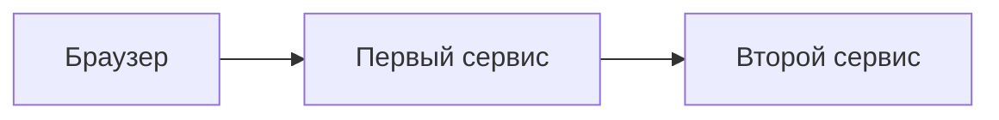

# Трассировка запроса: trace id и корреляция

↑ [[AN 1.7 Инструменты исследования — DevTools, логи, трассировки|1.7 Инструменты исследования: DevTools, логи, трассировки]] · ← [[AN 1.7.3 Читать логи — Kibana, Grafana Loki, Sentry|Предыдущая]] · → [[AN 1.7.5 curl и командная строка — минимум|Следующая]]

<!-- meta:start -->
<div class="meta-strip"><span class="badge should">Желательно</span><span class="chip">~4 мин чтения</span><span class="chip">Уровень: middle</span></div>
<!-- meta:end -->

> [!info] Зачем это аналитику и PM
> Один отказ на экране часто собран из нескольких сервисов. Общий идентификатор связывает строку браузера со строками журналов. Без него поддержка ищет «около двух часов» и находит чужой запрос.

## План темы
- [x] как найти путь запроса через сервисы
- [x] зачем correlation id в багрепортах

## Объяснение

Трассировка — путь одного действия через сервисы. У пути есть идентификатор, trace id. Кусок пути внутри одного сервиса называют span. Журналы, которые пишут тот же идентификатор, можно собрать в одну историю.

Correlation id в багрепорте — тот номер, по которому у вас реально ищут. Иногда это и есть trace id. Иногда команда завела отдельное поле и отдельный заголовок. Имя заголовка не универсально. Стандарт W3C для передачи контекста называется `traceparent`. Свой заголовок компании может называться иначе. В отчёт кладут тот, что виден в ответе или в журнале, и пишут его имя.

Как номер квитанции в нескольких отделах. Склад, касса и доставка ставят один номер. Без номера это три разных истории.

Не каждый запрос сохраняют целиком. Сэмплирование оставляет часть следов. Если идентификатор есть в ответе, а в хранилище следов пусто, это ещё не выдумка клиента. Спросите, какой процент сохраняют. Цифру в эту заметку не копируют.



Один и тот же идентификатор должен встретиться у всех трёх, если сервисы его передают дальше. Дырка на втором сервисе значит: заголовок не пробросили или журнал этого шага пишется в другое место.

## Примеры

Образец заголовка из документа W3C Trace Context, не живой вызов:

```text
traceparent: 00-4bf92f3577b34da6a3ce929d0e0e4736-00f067aa0ba902b7-01
```

Средняя группа из 32 шестнадцатеричных знаков — trace id. Короткая группа следом — span id. В багрепорт обычно кладут trace id и имя заголовка, откуда его взяли.

Карточка для отчёта:

```text
Заголовок: как на стенде test
trace id: 4bf92f3577b34da6a3ce929d0e0e4736
Время: 2026-10-04 14:10 MSK
Шаг, которого не видно: второй сервис не пишет этот id
```

## Нюансы и подводные камни

- Идентификатор из другого запроса той же минуты ведёт не туда. Сверьте время и действие.
- Копирование всего `traceparent` полезно, но в поиске часто индексируют только trace id. Уточните, какое поле вбивать.
- Внутренний вызов без проброса заголовка обрывает путь. Это дефект наблюдения, его так и называют.
- Идентификатор не секрет сам по себе, но рядом в журнале бывают персональные поля. В чат их не дублируют.
- Нет id в ответе — корреляцию не из чего начать. Это отдельная дыра, не повод гадать по тексту ошибки.

## Практика

Возьмите учебный ответ или образец `traceparent` выше. Выпишите trace id отдельно от span id и одной фразой скажите, в каком журнале его искать первым.

**Ожидаемый результат:** в заметке 32 знака trace id, имя заголовка и стенд. Span id не выдан за идентификатор всего пути. Живого допуска нет.

## Вопросы с ответами

> [!question]- Trace id и correlation id — всегда одно поле?
> Нет. Trace id относится к следу вызова. Correlation id — имя, которым пользуется команда. Они совпадают только если так договорились. В отчёте пишите фактическое имя.

> [!question]- Зачем он в багрепорте?
> По нему склеивают браузер и несколько сервисов. Время без номера находит чужие строки.

> [!question]- Что делать, если в хранилище следов пусто?
> Проверить журнал по тому же id и спросить про сэмплирование. Пустой след не отменяет строки лога и не доказывает, что запроса не было.

> [!question]- Какой заголовок требовать от API?
> Тот, который команда уже пишет в журналы. `traceparent` — стандарт передачи, не обещание, что ваш шлюз его отдаёт наружу.

## Связано с блоком Developer

- [[DO 7.9 Распределённый трейсинг — Tempo, Jaeger, sampling|7.9 Распределённый трейсинг — Tempo, Jaeger, sampling]]
- [[BE 7.2.4 Распределённый трейсинг — trace context, W3C traceparent, проброс через gRPC и HTTP|traceparent и проброс]]

## Связанные темы

- [[AN 1.7.3 Читать логи — Kibana, Grafana Loki, Sentry|Где вбивать идентификатор]]
- [[AN 1.7.1 DevTools браузера — вкладка Network|Где увидеть заголовок ответа]]
- [[BE 7.2.2 Структурные логи — Serilog, корреляция, уровни, что не логировать|Что не класть в лог]]
